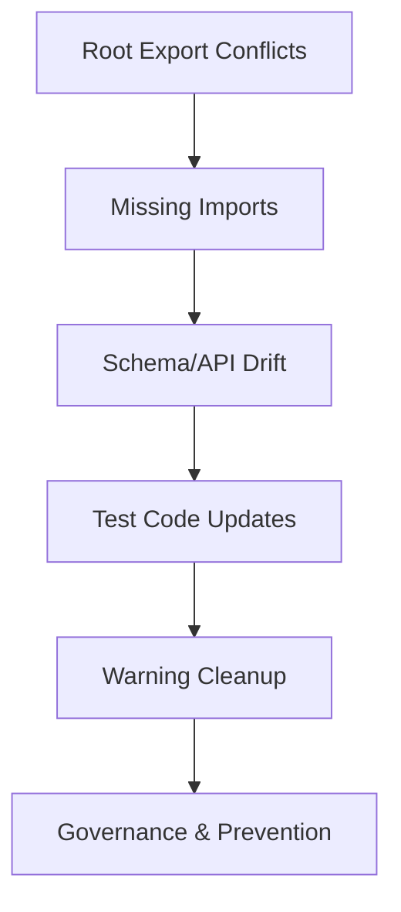

# Compilation Error Fixes — Design Document

## Overview

This design document outlines the systematic approach to fixing compilation errors in the racing wheel software codebase while establishing governance to prevent future regressions. The fixes are categorized into logical groups, prioritized to restore buildability, and coupled with schema stability policies to ensure this class of breakage doesn't recur.

## Architecture

### Error Classification System

The compilation errors fall into three main categories:

1. **Root-level Export Conflicts** - Namespace collisions from glob re-exports
2. **Missing Imports & API Changes** - Standard library imports and function signature changes  
3. **Schema/API Drift** - Struct field renames and additions that broke existing code

### Fix Strategy

The fixes will be applied in dependency order to minimize cascading compilation errors:



### Schema/API Governance

**Public API Stability Policy:**
- `engine` and `schemas` crates treat semver strictly
- Breaking renames/shape changes require minor version bump + migration path
- Deprecation window: old names marked `#[deprecated]` for one minor before removal

**Break Detection:**
- Protobuf: `buf breaking --against <main>` in CI
- JSON Schema: frozen `profile.v1.json` with round-trip regression tests
- Compile-time tests validate current struct instantiation

## Components and Interfaces

### 1. Root Export Resolution

**Problem:** Conflicting re-exports of `FFBMode` from multiple modules
```rust
pub use rt::*;    // exports FFBMode
pub use ffb::*;   // also exports FFBMode - CONFLICT
```

**Solution:** Unify at source with canonical public type
```rust
// crates/engine/src/ffb/mod.rs - rename internal enum
pub(crate) enum PipelineMode { /* internal FFB pipeline modes */ }

// crates/engine/src/lib.rs - single canonical export
pub use rt::FFBMode;  // The one public FFBMode
pub use rt::{EngineClock, RtConfig};
pub use ffb::{Pipeline, FilterConfig};
```

**Design Decision:** Exactly one public `FFBMode` (lives in `rt`). Internal enums use distinct names (`PipelineMode`) and remain `pub(crate)`.

### 2. Import Resolution System

**Missing Standard Library Imports:**
- `std::sync::{Arc, Mutex}` in test modules (prefer `AtomicBool` for simple flags)
- `std::time::Duration` in metrics and test code
- Proper scoping to avoid name collisions with existing test helpers

**Implementation Pattern:**
```rust
#[cfg(test)]
mod tests {
    use super::*;
    use std::sync::atomic::{AtomicBool, Ordering};  // Prefer for simple flags
    use std::time::Duration;
    
    // For complex shared state only:
    use std::sync::{Arc, Mutex};
}
```

**Policy:** Prefer `AtomicBool` over `Arc<Mutex<bool>>` in tests to avoid lock overhead and false deadlock positives.

### 3. Schema Migration Strategy

**TelemetryData Field Mapping:**
```rust
// Old → New field names
wheel_angle_mdeg → wheel_angle_deg
wheel_speed_mrad_s → wheel_speed_rad_s  
temp_c → temperature_c
faults → fault_flags
sequence → (removed - drop assertions)
```

**Compat Layer (Temporary):**
```rust
// crates/compat/src/telemetry_compat.rs (test-only dependency)
#[cfg(test)]
pub trait TelemetryCompat {
    fn temp_c(&self) -> u8;
    fn faults(&self) -> u8;
    fn wheel_angle_mdeg(&self) -> i32;
    fn wheel_speed_mrad_s(&self) -> i16;
}

#[cfg(test)]
impl TelemetryCompat for TelemetryData {
    #[inline] fn temp_c(&self) -> u8 { self.temperature_c }
    #[inline] fn faults(&self) -> u8 { self.fault_flags }
    #[inline] fn wheel_angle_mdeg(&self) -> i32 { self.wheel_angle_deg }
    #[inline] fn wheel_speed_mrad_s(&self) -> i16 { self.wheel_speed_rad_s }
}
```

**FilterConfig Missing Fields:**
Add required fields with sensible defaults:
```rust
FilterConfig {
    // existing fields...
    bumpstop: BumpstopConfig::default(),
    hands_off: HandsOffConfig::default(), 
    torque_cap: Some(TorqueNm(10.0)),
    ..FilterConfig::default()  // Use struct update syntax
}
```

### 4. Function Signature Updates

**DeviceId Construction & Conversions:**
```rust
// Old (incorrect)
DeviceId::new(device_list[0].id.clone())?
// New (correct) 
device_list[0].id.clone()  // Already a DeviceId

// Add conversion traits to prevent future issues:
impl std::fmt::Display for DeviceId { /* delegate to inner */ }
impl From<String> for DeviceId { /* validate */ }
impl From<DeviceId> for String { /* into inner */ }

// Test comparisons:
assert_eq!(devices[0].id.to_string(), "hotplug-test");
```

**Property Test Functions:**
Keep parametric tests with deterministic seeds:
```rust
use proptest::prelude::*;

proptest! {
    #[test]
    fn prop_safety_policy_never_exceeds_device_limit(
        requested in 0f32..25f32, 
        device_max in 5f32..25f32, 
        is_high in any::<bool>()
    ) {
        // Test with actual parameters - don't neuter the randomness
        // Failures will print seeds for reproduction
    }
}
```

**RT Path Error Handling:**
```rust
// Handle write_ffb_report Result without RT impact
if let Err(_) = ctx.device.write_ffb_report(final_torque_nm, ctx.seq) {
    // Non-allocating error accounting
    ctx.counters.hid_write_errors.fetch_add(1, Ordering::Relaxed);
    // Send lossy diagnostic to side thread (non-blocking)
}
```

## Data Models

### Error Tracking Schema

```rust
pub struct CompilationFix {
    pub category: FixCategory,
    pub file_path: String,
    pub description: String,
    pub priority: Priority,
    pub dependencies: Vec<String>,
}

pub enum FixCategory {
    ExportConflict,
    MissingImport,
    SchemaDrift,
    TestUpdate,
    WarningCleanup,
}

pub enum Priority {
    Critical,  // Blocks compilation
    High,      // Causes warnings that may become errors
    Medium,    // Code quality improvements
}
```

### Fix Application Order

1. **Critical Path Fixes** (must be applied first):
   - Root export conflicts
   - Missing standard library imports
   - Core schema field updates

2. **Dependent Fixes** (can be applied after critical path):
   - Test code updates
   - Example code updates
   - Function signature corrections

3. **Quality Improvements** (can be applied last):
   - Warning cleanup
   - Dead code removal
   - Unused import removal

## Error Handling

### Fix Validation Strategy

Each fix category has specific validation criteria:

**Export Conflicts:**
- Verify no duplicate symbol errors
- Confirm all public APIs remain accessible
- Check that no breaking changes are introduced

**Import Resolution:**
- Ensure all symbols resolve correctly
- Verify no name shadowing occurs
- Confirm test isolation is maintained

**Schema Updates:**
- Validate all field accesses use correct names
- Ensure struct initialization includes all required fields
- Confirm type compatibility is maintained

### Rollback Strategy

If any fix introduces runtime regressions:
1. Revert the specific change
2. Analyze the root cause
3. Apply a more conservative fix
4. Re-validate the change

## Testing Strategy

### Compilation Validation

```rust
// Ensure critical types compile correctly
#[test]
fn test_schema_compilation() {
    let _config = FilterConfig::default();
    let _telemetry = TelemetryData {
        wheel_angle_deg: 0.0,
        wheel_speed_rad_s: 0.0,
        temperature_c: 25,
        fault_flags: 0,
        hands_on: true,
        timestamp: 0,
    };
}

// Compile-time check for deprecated field usage
#[test]
fn forbid_deprecated_fields() {
    // This will fail to compile if deprecated fields are used
    // Can be enhanced with trybuild for compile-fail tests
}
```

### Property Testing Standards

- **Deterministic seeds:** Surface failing seeds for reproduction
- **Shrinking enabled:** Use proptest or QuickCheck with shrinking
- **Parametric tests:** Keep randomness, don't convert to zero-arg functions
- **Slow config:** `proptest_config_slow()` for nightly/perf lanes only

### Regression Prevention

**CI Lint Gates:**
```yaml
# .github/workflows/compilation-check.yml
- name: Clippy with warnings as errors
  run: cargo clippy --all --all-features -- -D warnings -D clippy::unwrap_used

- name: Check for deprecated field names  
  run: |
    if grep -r "wheel_angle_mdeg\|wheel_speed_mrad_s\|temp_c\|\.faults" crates/; then
      echo "Found deprecated field names"
      exit 1
    fi

- name: Schema break detection
  run: buf breaking --against origin/main

- name: Unused dependencies
  run: cargo udeps --all-targets

- name: Format check
  run: cargo fmt --check
```

**Crate-level Lints:**
```rust
// In non-test crates
#![deny(static_mut_refs)]
#![deny(unused_must_use)]
#![deny(clippy::unwrap_used)]
```

### Integration Testing

Verify that fixes don't break existing functionality:
- Run existing test suite after each fix category
- Validate that virtual device integration still works
- Confirm that the RT engine can still be instantiated

## Performance Considerations

### Minimal Runtime Impact

All fixes are designed to have zero runtime performance impact:
- Import changes only affect compilation
- Field renames are compile-time only
- Export changes don't affect generated code

### RT Path Error Handling Policy

When touching RT codepaths (e.g., `write_ffb_report` Result handling):
- **Count errors in atomics:** `fetch_add(1, Ordering::Relaxed)`
- **No logging in hot path:** Use out-of-band diagnostics
- **Non-blocking side channels:** Send lossy signals to diagnostic threads
- **Periodic aggregation:** Log error summaries off the RT thread

### Build Time Optimization

- Apply fixes in dependency order to minimize recompilation
- Use incremental compilation where possible
- Group related changes to reduce build iterations

## Definition of Done (DoD) Table

| Fix Category | Definition of Done |
|--------------|-------------------|
| **Export Conflicts** | `cargo check` shows no duplicate symbols; public prelude compiles |
| **Imports** | No E0433 in any crate/test; only `std::sync::{Arc,Mutex}` or `Atomic*` used in tests; `Duration` imported where used |
| **Schema Drift** | All `TelemetryData`/`FilterConfig` in examples/tests compile; compat shim used ≤ N occurrences (tracked) |
| **Property Tests** | All property tests parametric; failures print seeds; CI artifact includes seed |
| **Warnings** | Non-test crates build with `-D warnings`; no `unused_must_use` |
| **Governance** | Schema break detection in CI; deprecated field grep fails on increase |

## Module Testing Boundaries

**Policy:**
- **Prefer integration tests** under `/tests/` using only public APIs
- **Use `#[cfg(test)] mod tests`** only when hitting internals is required
- **Keep imports local** to test modules to avoid production pollution
- **Avoid reaching into internal paths** from test modules when possible

## Implementation Plan

### Phase 1: Critical Compilation Fixes
1. Resolve root export conflicts with canonical `FFBMode`
2. Add missing standard library imports (prefer `AtomicBool`)
3. Fix core schema field references with compat layer

### Phase 2: Test and Example Updates  
1. Restore parametric property tests with deterministic seeds
2. Update test code to use correct field names via compat layer
3. Update example code and add conversion traits for `DeviceId`

### Phase 3: Quality and Governance
1. Remove unused imports and variables
2. Address dead code warnings with appropriate `#[allow]` attributes
3. Add CI lint gates and schema break detection
4. Implement deprecation tracking and migration metrics

### Validation Checkpoints

After each phase:
- Verify clean compilation with no errors or warnings
- Run existing test suite to check for regressions  
- Validate that core functionality remains intact
- Check that RT performance is unaffected by error handling changes

This systematic approach ensures that compilation errors are resolved efficiently while establishing governance to prevent future regressions and maintaining the real-time performance guarantees of the system.