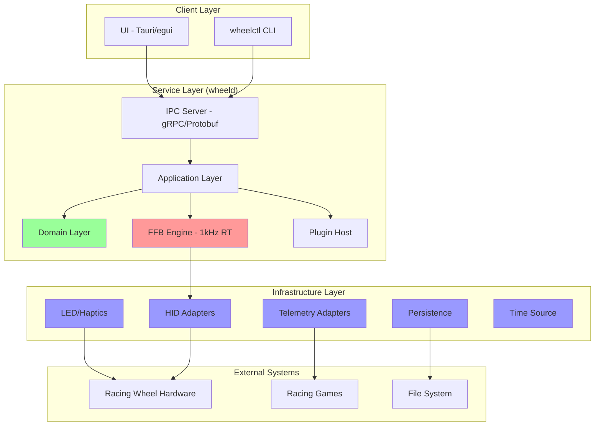

# Racing Wheel Software — Design Document (v1.0)

**Document status:** Draft for review  
**Based on:** Requirements v1.0  
**Owners:** Architecture, Engineering

## Overview

This design document outlines the architecture for a cross-platform racing wheel software suite built on clean architecture principles with schema-first contracts. The system consists of a real-time service (`wheeld`) that manages devices and force feedback at 1kHz, communicating with thin UI and CLI clients over versioned IPC. The design prioritizes safety, observability, and extensibility while maintaining strict performance budgets for the force feedback pipeline.

## Architecture

### High-Level System Architecture



### Clean Architecture Layers

**Domain Layer (Pure Core)**
- Entities: Device, Profile, FilterConfig, SafetyState
- Value Objects: TorqueNm, Degrees, DeviceId, ProfileId
- Policies: Safety rules, profile merging, torque limits
- No dependencies on OS, I/O, or serialization

**Application Layer (Use Cases)**
- ProfileService: CRUD operations, hierarchy resolution
- DeviceService: Enumeration, calibration, health monitoring  
- GameService: Telemetry configuration, auto-switching
- SafetyService: Torque gate management, fault handling
- DiagnosticService: Blackbox recording, support bundles

**Infrastructure Layer (Adapters)**
- HID adapters for Windows/Linux device I/O
- Telemetry adapters per racing sim
- Persistence adapters for profiles and diagnostics
- LED/Haptics output adapters

## Components and Interfaces

### 1. Real-Time Force Feedback Engine

The FFB engine is the critical component that processes force feedback at 1kHz with strict timing requirements.

**FFB Mode Matrix:**
The engine supports three mutually exclusive modes per device:

| Mode | Source of torque | Device protocol | When to use |
|------|------------------|-----------------|-------------|
| PID pass-through | Game emits DirectInput/PID effects | HID PID (0x0F) | Commodity wheels; we do calibration, safety, LEDs/dash only |
| Raw-torque (preferred) | Host synthesizes torque @1 kHz | OWP-1 HID OUT report | Open-protocol bases; enables full filter pipeline |
| Telemetry-synth (fallback) | Host computes torque from game telemetry | OWP-1 | Arcade/console-ported titles without robust FFB |

**Capability Negotiation:**
On connect, host reads Feature Report 0x01 (Caps):
```c
struct device_caps {
    uint8_t  supports_pid : 1;
    uint8_t  supports_raw_torque_1khz : 1;
    uint8_t  supports_health_stream : 1;
    uint8_t  supports_led_bus : 1;
    uint16_t max_torque_cNcm;
    uint16_t encoder_cpr;
    uint8_t  min_report_period_us;  // typically 1000
};
```

**Architecture:**
```rust
pub struct Engine {
    mode: FFBMode,
    pipeline: Pipeline,
    device_writer: Box<dyn HidDevice>,
    input_ring: SPSCReceiver<Frame>,
    blackbox_ring: SPSCProducer<Frame>,
    rt_thread: JoinHandle<()>,
    scheduler: AbsoluteScheduler,
}

#[repr(C)]
pub struct Frame {
    pub ffb_in: f32,        // -1..1 from game
    pub torque_out: f32,    // -1..1 after filters
    pub wheel_speed: f32,   // rad/s for speed-adaptive filters
    pub hands_off: bool,
    pub ts_mono_ns: u64,
    pub seq: u16,           // sequence number for device
}
```

**Filter Pipeline:**
The pipeline compiles filter configurations into a flat vector of function pointers with pre-allocated state, avoiding trait objects and dynamic dispatch on the hot path.

```rust
pub struct Pipeline {
    nodes: Vec<fn(&mut Frame, *mut u8)>,  // Function pointers
    state: Vec<u8>,                       // SoA state storage
}

// Two-phase apply: compile off-thread, swap at tick boundary
impl Pipeline {
    pub fn compile_from_config(config: &FilterConfig) -> Self { /* ... */ }
    pub fn swap_at_tick_boundary(&mut self, new_pipeline: Pipeline) { /* ... */ }
}
```

**Timing & Scheduling:**
- **Engine clock:** Absolute schedule via `clock_nanosleep(..., TIMER_ABSTIME)` (Linux) / `WaitableTimer` (Windows)
- **PLL:** Track drift to USB frames; correct phase slowly to avoid step jitter
- **Busy-spin tail:** Final ~50-80 µs busy-wait using `QueryPerformanceCounter`/`rdtsc` to hit deadlines

**Windows RT Specifics:**
- Join MMCSS (`AvSetMmThreadCharacteristicsW("Games")`)
- Disable power throttling (`PROCESS_POWER_THROTTLING_EXECUTION_SPEED`)
- Use `CreateFile` + `WriteFile` on HID interrupt OUT; avoid `HidD_SetOutputReport` in hot path

**Linux RT Specifics:**
- Acquire RT priority via rtkit (no root), `SCHED_FIFO` with ceiling tuned
- Call `mlockall(MCL_CURRENT|MCL_FUTURE)`
- Use UDS `SOCK_SEQPACKET` for IPC; ensure `RLIMIT_RTPRIO` and memlock set

### 2. Device Management System

**HID Abstraction:**
```rust
#[async_trait]
pub trait HidPort: Send + Sync {
    async fn list_devices(&self) -> Result<Vec<DeviceInfo>>;
    async fn open(&self, id: &DeviceId) -> Result<Box<dyn HidDevice>>;
}

#[async_trait]
pub trait HidDevice: Send {
    fn write_ffb_report(&mut self, torque_nm: f32);  // RT-safe
    async fn configure_base(&mut self, settings: &BaseSettings) -> Result<()>;
    async fn read_telemetry(&mut self) -> Result<DeviceTelemetry>;
}
```

**Platform Implementations:**
- **Windows:** hidapi with overlapped I/O, MMCSS thread priority
- **Linux:** /dev/hidraw* with libudev for enumeration, SCHED_FIFO priority

**OWP-1 — Open Wheel Protocol:**

HID OUT report 0x20 — Torque command (every 1 ms):
```c
struct torque_command {
    uint8_t  report_id;     // 0x20
    int16_t  torque_mN_m;   // Q8.8, full-scale declared in Caps
    uint8_t  flags;         // bit0: hands_on_hint, bit1: sat_warn
    uint16_t seq;           // wraps; host increments
};
```

HID IN report 0x21 — Telemetry/health (60–200 Hz):
```c
struct device_telemetry {
    uint8_t report_id;      // 0x21
    int32_t wheel_angle_mdeg;
    int16_t wheel_speed_mrad_s;
    uint8_t temp_c;
    uint8_t faults;         // bitfield: usb, encoder, thermal, ocp
    uint8_t hands_on;       // 0/1 if device can detect
};
```

Feature 0x02 — Configuration:
DOR, bumpstop model, torque cap, notch EQ table upload (if device supports on-MCU filters).
All changes idempotent; ack via 0x22 "ConfigAck".

### 3. Profile System

**Profile Hierarchy:**
```rust
pub struct ProfileManager {
    global: Profile,
    game_profiles: HashMap<String, Profile>,
    car_profiles: HashMap<(String, String), Profile>,
    session_overrides: Profile,
}

impl ProfileManager {
    pub fn resolve(&self, scope: &ProfileScope) -> Profile {
        // Deterministic merge: Global → Game → Car → Session
        // Units: Strong types (TorqueNm, Degrees) at schema and code level
        // Merge order: Explicit last-writer-wins on scalar leaves
        // Monotonic curves: Validate curve_points monotonicity at validation
        let mut result = self.global.clone();
        if let Some(game_profile) = self.game_profiles.get(&scope.game) {
            result.merge_deterministic(game_profile);
        }
        if let Some(car_profile) = self.car_profiles.get(&(scope.game, scope.car)) {
            result.merge_deterministic(car_profile);
        }
        result.merge_deterministic(&self.session_overrides);
        result
    }
    
    // Two-phase apply: Compile pipeline off-thread → swap at tick boundary → ack to UI
    pub async fn apply_profile(&mut self, profile: Profile) -> Result<()> {
        let compiled_pipeline = Pipeline::compile_from_config(&profile.base_settings.filters).await?;
        self.engine.swap_at_tick_boundary(compiled_pipeline).await?;
        Ok(())
    }
}
```

**JSON Schema Validation:**
Profiles are validated against JSON Schema at load time, with migration support for version upgrades.

### 4. Game Integration System

**Telemetry Adapter Pattern:**
```rust
#[async_trait]
pub trait TelemetryAdapter: Send + Sync {
    fn game_id(&self) -> &str;
    async fn configure(&self, install_path: &Path) -> Result<()>;
    async fn start_monitoring(&self) -> Result<TelemetryReceiver>;
    fn normalize(&self, raw: &[u8]) -> Result<NormalizedTelemetry>;
}

pub struct NormalizedTelemetry {
    pub ffb_scalar: f32,
    pub rpm: f32,
    pub speed_ms: f32,
    pub slip_ratio: f32,
    pub gear: i8,
    pub flags: TelemetryFlags,
    pub car_id: Option<String>,
    pub track_id: Option<String>,
}
```

**Auto-Configuration:**
Each adapter implements game-specific configuration file writing using table-driven approach:

**Support Matrix (maintained in CI):**
| Game | FFB Scalar | RPM | Car ID | DRS | Config Writer |
|------|------------|-----|--------|-----|---------------|
| iRacing 2024.x | ✓ | ✓ | ✓ | N/A | app.ini[v17] |
| ACC 1.9.x | ✓ | ✓ | ✓ | ✓ | UDP broadcast |
| AMS2 1.5.x | ✓ | ✓ | ✗ | ✗ | Shared memory |

**Table-Driven Writers:**
- One JSON file per sim version lists "expected diffs" to apply
- Unit tests compare filesystem fixtures
- Sanity tests: after configure, send test telemetry → expect LED blink pattern

### 5. Safety State Machine

**High-Torque Unlock Protocol:**
1. UI requests unlock → service evaluates conditions
2. Service emits challenge to device
3. User must hold physical combo (e.g., both clutch paddles 2 s)
4. Device sends Ack in IN report with rolling token
5. Service arms high-torque; state persists until power-cycle

```rust
pub enum SafetyState {
    SafeTorque,
    HighTorqueChallenge { challenge_token: u32, expires: Instant },
    HighTorqueActive { since: Instant, device_token: u32 },
    Faulted { fault: FaultType, since: Instant },
}

pub struct SafetyService {
    state: SafetyState,
    max_safe_torque: TorqueNm,
    fault_handlers: FaultHandlerMap,
}
```

**Fault FMEA (Failure Mode & Effects Analysis):**

| Failure | Detection | Action (≤50 ms) | Post-mortem |
|---------|-----------|-----------------|-------------|
| USB stall/timeout | no OUT ack 3 frames | Ramp torque→0, enter SafeTorque | Blackbox mark, retry with backoff |
| Encoder NaN | sanity check | Latched fault, SafeTorque | Capture last 2 s of frames |
| Plugin overrun | watchdog misses deadline | Drop plugin, keep engine | Count, quarantine plugin ID |
| Thermal | temp ≥ threshold | SafeTorque + audible cue | Cooldown hysteresis |

### 6. IPC and Client Communication

**Protocol Definition (Protobuf):**
```protobuf
service WheelService {
  rpc ListDevices(google.protobuf.Empty) returns (stream DeviceInfo);
  rpc GetActiveProfile(DeviceId) returns (Profile);
  rpc ApplyProfile(ApplyProfileRequest) returns (OpResult);
  rpc StartHighTorque(DeviceId) returns (OpResult);
  rpc SubscribeHealth(google.protobuf.Empty) returns (stream HealthEvent);
  rpc ConfigureTelemetry(ConfigureTelemetryRequest) returns (OpResult);
}

message DeviceInfo {
  string id = 1;
  string name = 2;
  double max_torque_nm = 3;
  uint32 max_dor_deg = 4;
  repeated string components = 5;
}
```

**Transport Layer:**
- **Windows:** Named Pipes (`\\.\pipe\wheel`) with ACL restrictions
- **Linux:** Unix Domain Sockets (`/run/user/<uid>/wheel.sock`)
- **Framing:** Protobuf with length prefixes
- **Versioning:** Feature negotiation on connect

### 7. Plugin Architecture

**Safe Plugins (WASM/WASI):**
- 60–200 Hz update rate
- Capability manifest declares required permissions
- No file/network access by default
- Crash-isolated from service

```rust
pub trait SafePlugin {
    fn manifest(&self) -> PluginManifest;
    fn process_telemetry(&mut self, input: &NormalizedTelemetry) -> Result<PluginOutput>;
    fn process_led_mapping(&mut self, input: &LedMappingInput) -> Result<LedPattern>;
}
```

**Fast Plugins (Native, Optional):**
- Loaded in `wheel-dsp` helper process
- Communication via shared memory SPSC ring with µs-budget stamped on each tick
- **Enforcement:** If helper misses N deadlines/second, service cuts plugin for the session
- **Versioning:** Semantic with feature bits; helper refuses ABI-mismatched nodes

```c
typedef struct {
    float ffb_in, torque_out, wheel_speed;
    uint64_t ts_ns;
    uint32_t budget_us;  // Time budget for this tick
} frame_t;

typedef struct {
    void* (*create)(const uint8_t* config, size_t len);
    void (*process)(void* state, frame_t* frame);  // Must be RT-safe
    void (*destroy)(void* state);
    uint32_t abi_version;
} plugin_vtbl_t;
```

## Data Models

### Core Domain Entities

```rust
pub struct Device {
    pub id: DeviceId,
    pub name: String,
    pub device_type: DeviceType,
    pub capabilities: DeviceCapabilities,
    pub state: DeviceState,
}

pub struct Profile {
    pub schema_version: String,
    pub scope: ProfileScope,
    pub base_settings: BaseSettings,
    pub led_config: LedConfig,
    pub haptics_config: HapticsConfig,
    pub signature: Option<Signature>,
}

pub struct BaseSettings {
    pub ffb_gain: f32,           // 0.0..1.0
    pub dor_degrees: Degrees,    // 180..2160
    pub torque_cap: TorqueNm,
    pub filters: FilterConfig,
}

pub struct FilterConfig {
    pub reconstruction: u8,      // 0..8
    pub friction: f32,           // 0.0..1.0
    pub damper: f32,
    pub inertia: f32,
    pub notch_filters: Vec<NotchFilter>,
    pub slew_rate: f32,
    pub curve_points: Vec<(f32, f32)>,  // Monotonic
}
```

### Persistence Schema

**Profile JSON Structure:**
```json
{
  "schema": "wheel.profile/1",
  "scope": {
    "game": "iracing",
    "car": "gt3"
  },
  "base": {
    "ffb_gain": 0.68,
    "dor_deg": 540,
    "torque_cap_nm": 10.0,
    "filters": {
      "reconstruction": 4,
      "friction": 0.12,
      "damper": 0.18,
      "inertia": 0.08,
      "notch": [{"hz": 7.5, "q": 3.0, "gain_db": -10.0}],
      "slew_rate": 0.85,
      "curve": [
        {"in": 0.0, "out": 0.0},
        {"in": 0.5, "out": 0.6},
        {"in": 1.0, "out": 1.0}
      ]
    }
  },
  "leds": {
    "rpm_bands": [0.75, 0.82, 0.88, 0.92, 0.96],
    "pattern": "wipe"
  },
  "signature": "base64-encoded-ed25519-signature"
}
```

## Error Handling

### Error Categories

1. **Domain Errors:** Invalid configurations, constraint violations
2. **Infrastructure Errors:** Device I/O failures, network issues
3. **Safety Errors:** Fault conditions, torque limit violations
4. **System Errors:** Resource exhaustion, permission issues

### Error Propagation Strategy

```rust
pub enum WheelError {
    Domain(DomainError),
    Infrastructure(InfraError),
    Safety(SafetyError),
    System(SystemError),
}

// Real-time path uses Result<(), RTError> with pre-allocated error codes
pub enum RTError {
    DeviceDisconnected = 1,
    TorqueLimit = 2,
    PipelineFault = 3,
}
```

**Error Recovery:**
- **RT Thread:** Log error code, trigger soft-stop, continue operation
- **Application Layer:** Retry with exponential backoff, degrade gracefully
- **UI Layer:** Display user-friendly messages with suggested actions

## Testing Strategy

### Unit Testing
- **Domain Logic:** Property-based testing for profile merging, filter stability
- **Filter Nodes:** Deterministic input/output validation, bounds checking
- **Safety Logic:** State machine transitions, fault condition handling

### Integration Testing
- **HID Layer:** Mock devices for enumeration, I/O, and fault injection
- **Telemetry:** Recorded game data playback and normalization validation
- **IPC:** Client/server contract testing with schema validation

### Hardware-in-Loop (HIL) Testing
```rust
pub struct HILTestRig {
    recorded_ffb: Vec<Frame>,
    expected_outputs: Vec<f32>,
    timing_validator: TimingValidator,
}

impl HILTestRig {
    pub fn replay_and_validate(&self) -> HILResult {
        // Feed recorded FFB through engine
        // Validate timing with oscilloscope
        // Compare outputs within tolerance
    }
}
```

### Acceptance Test Mapping
Map requirement IDs to named tests:
- **FFB-01-A jitter:** Run loop 10 min; p99 ≤0.25 ms
- **SAFE-03-C USB yank:** Disconnect at 5 Nm; torque→0 ≤50 ms  
- **GI-01-B ACC writer:** Golden-file diff of config; LED heartbeat received
- **PLUG-02-A overrun:** Synthetic 100 µs node; ensure helper is cut after N misses

### Performance Testing
- **Latency:** End-to-end timing with loopback measurement
- **Jitter:** Statistical analysis of 1kHz tick intervals
- **CPU Usage:** Profiling under various telemetry loads
- **Memory:** Leak detection and allocation tracking

### Soak Testing
- **48-hour continuous operation** with synthetic telemetry
- **Hot-plug stress testing** with rapid connect/disconnect cycles
- **Thermal testing** with sustained high-torque operation

## Performance Considerations

### Real-Time Guarantees

**Thread Priorities:**
- RT FFB thread: Highest priority, dedicated core
- HID I/O thread: High priority
- Telemetry threads: Normal priority
- IPC/UI threads: Below normal priority

**Memory Management:**
- Pre-allocate all RT path data structures
- Use memory pools for non-RT allocations
- Lock memory pages to prevent swapping

**Timing Budget Allocation:**
```
Total budget: 1000μs @ 1kHz
├── Input processing: 50μs
├── Filter pipeline: 200μs (median), 800μs (p99)
├── Output formatting: 50μs
├── HID write: 100μs (median), 300μs (p99)
└── Safety checks: 50μs
```

### Scalability

**Multi-Device Support:**
- Each device gets its own RT thread and pipeline
- Shared telemetry bus with fan-out to device threads
- Independent safety state machines per device

**Plugin Performance:**
- WASM plugins limited to 60Hz update rate
- Native plugins get dedicated time slice in RT budget
- Plugin crashes isolated to helper processes

## Security Model

### Attack Surface Analysis

**IPC Interface:**
- Authenticated via OS-level permissions (pipe ACLs, socket permissions)
- Input validation on all Protobuf messages
- Rate limiting to prevent DoS attacks

**Plugin System:**
- WASM plugins run in sandboxed environment with capability restrictions
- Native plugins require code signing and explicit user approval
- Plugin manifest declares required permissions

**Profile System:**
- Optional Ed25519 signatures for profile authenticity
- JSON Schema validation prevents malformed data injection
- Profile import requires user confirmation for unsigned profiles

### Privilege Separation

```
┌─────────────────┐    ┌─────────────────┐    ┌─────────────────┐
│   UI Process    │    │  Service Process │    │ Plugin Helper   │
│   (User)        │    │   (User)         │    │   (Restricted)  │
│                 │    │                  │    │                 │
│ - Profile edit  │    │ - Device I/O     │    │ - Plugin exec   │
│ - Display       │    │ - RT engine      │    │ - Sandboxing    │
│ - User input    │    │ - Safety logic   │    │ - Crash isolation│
└─────────────────┘    └─────────────────┘    └─────────────────┘
         │                       │                       │
         └───────── IPC ─────────┼───────── IPC ─────────┘
                                 │
                        ┌─────────────────┐
                        │   Hardware      │
                        │   (Kernel)      │
                        └─────────────────┘
```

## Deployment Architecture

### Service Management & OS Hardening

**Windows:**
- User-level service registered with Task Scheduler
- Set process PowerThrottling to off; request high performance power mode
- Disable USB selective suspend for device interface (documented optional step)
- Automatic startup on user login, service recovery on crashes

**Linux:**
- systemd user service (`~/.config/systemd/user/wheeld.service`)
- Install udev rules (group input/plugdev), recommend rtkit
- Socket activation for on-demand startup, automatic restart policies

**Anti-cheat compatibility:**
- No DLL injection; processes are separate
- Document telemetry methods used per sim
- No kernel drivers unless user explicitly enables virtual legacy device (deferred)

### Configuration Management

**Directory Structure:**
```
Windows: %LOCALAPPDATA%\Wheel\
Linux:   ~/.wheel/

├── config/
│   ├── service.toml
│   └── devices/
├── profiles/
│   ├── global.profile.json
│   ├── iracing/
│   └── acc/
├── plugins/
│   ├── safe/
│   └── native/
├── logs/
└── diag/
    └── blackbox/
```

### Update Mechanism

**Application Updates:**
- Delta patches downloaded over HTTPS
- Signature verification before application
- Rollback capability on startup failure

**Firmware Updates:**
- A/B partition scheme for atomic updates
- Health check after update with automatic rollback
- Progress reporting through IPC

This design provides a solid foundation for implementing the racing wheel software suite while meeting all the performance, safety, and extensibility requirements outlined in the requirements document.
## Bl
ackbox & System Tracing

### .wbb Format v1
- **Header:** WBB1, little-endian, device UUID, engine version, timebase, mode (PID/OWP/TELEM)
- **Streams:** A (1 kHz frames with per-node outputs), B (60 Hz telemetry), C (health/fault events)
- **Footer:** CRC32C, index every 100 ms for random seek

### System Tracing
- **Windows:** ETW provider `Wheel/Wheeld` with events: TickStart/End, HidWrite, DeadlineMiss
- **Linux:** tracefs markers or perfetto trace SDK integration

## Concurrency Model

### Thread Model
- One RT thread per device (affinity pin)
- One HID RX thread
- One telemetry thread pool  
- One IPC runtime

### Memory & Synchronization
- **Rings:** SPSC bounded (power-of-two size); RT never waits
- **Allocator:** Consider mimalloc/jemalloc for lower fragmentation; RT path uses no alloc
- **Panics:** `panic = "abort"` for RT thread; service catches and restarts RT with SafeTorque
- **Non-RT:** May drop frames on overflow and increments a metric

This design provides a comprehensive foundation that addresses all critical performance, safety, and extensibility requirements while maintaining the strict real-time guarantees needed for professional racing wheel software.