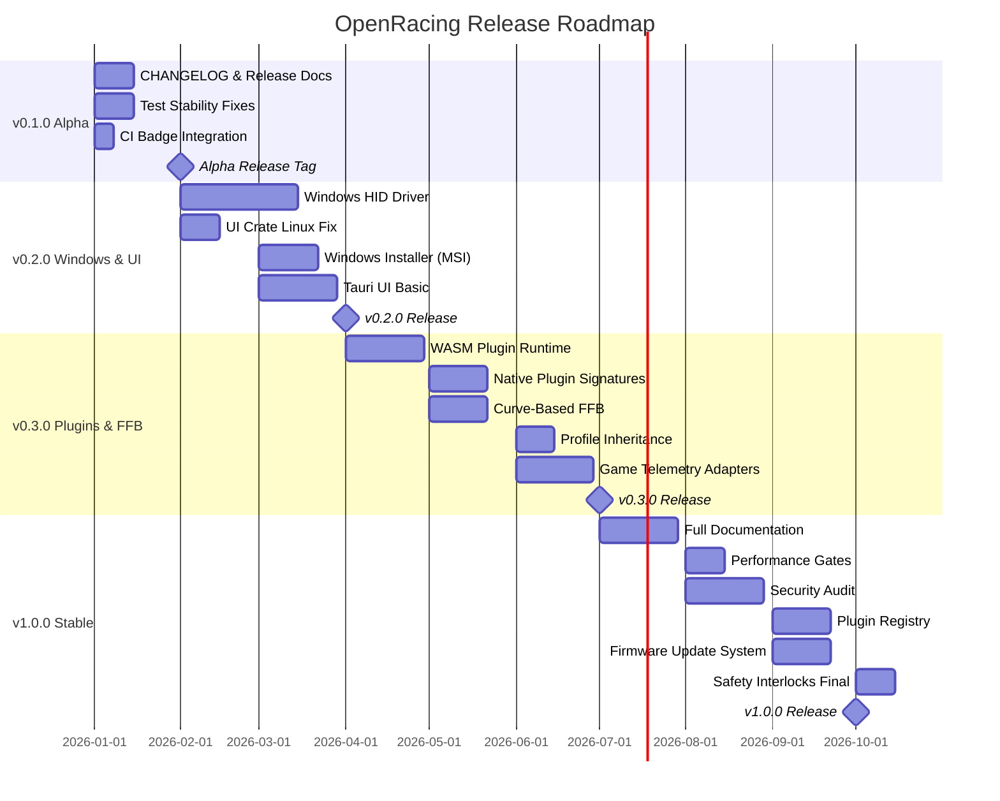
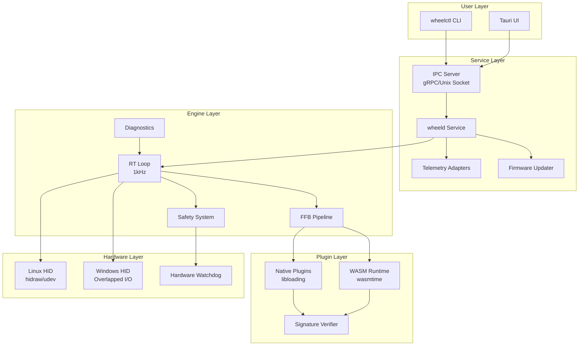
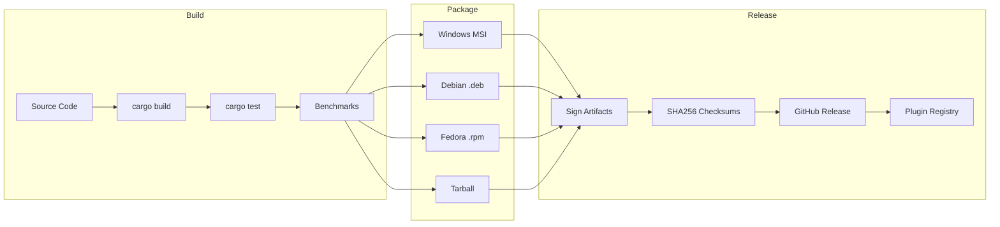

# Design Document: Release Roadmap v1.0

## Overview

This design document outlines the technical implementation for the OpenRacing release roadmap from v0.1.0-alpha through v1.0.0 stable. The roadmap is structured as four progressive milestones, each building on the previous to deliver a production-ready, safety-critical racing wheel force feedback system.

The design prioritizes:
1. **Safety**: Hardware watchdog integration, fault detection, and safe-state guarantees
2. **Performance**: 1kHz RT processing with zero allocations in hot paths
3. **Cross-platform**: Consistent behavior on Windows, Linux, and macOS
4. **Extensibility**: Plugin architecture for custom DSP, telemetry, and effects

### Milestone Overview



## Architecture

### System Architecture



### Release Artifact Flow



## Components and Interfaces

### 1. Release System Components

#### CHANGELOG Generator
```rust
/// CHANGELOG entry following Keep a Changelog format
pub struct ChangelogEntry {
    pub version: semver::Version,
    pub date: chrono::NaiveDate,
    pub added: Vec<String>,
    pub changed: Vec<String>,
    pub deprecated: Vec<String>,
    pub removed: Vec<String>,
    pub fixed: Vec<String>,
    pub security: Vec<String>,
    pub breaking: Vec<String>,
}

/// Generates CHANGELOG.md from git history and conventional commits
pub trait ChangelogGenerator {
    fn generate_from_commits(&self, since_tag: &str) -> Result<ChangelogEntry>;
    fn append_to_changelog(&self, entry: &ChangelogEntry) -> Result<()>;
    fn validate_format(&self, path: &Path) -> Result<bool>;
}
```

#### Release Artifact Builder
```rust
/// Platform-specific release artifact
pub enum ReleaseArtifact {
    WindowsMsi { path: PathBuf, product_code: Uuid },
    LinuxDeb { path: PathBuf, architecture: String },
    LinuxRpm { path: PathBuf, architecture: String },
    Tarball { path: PathBuf, compression: Compression },
    MacOsDmg { path: PathBuf },
}

/// Release artifact with cryptographic verification
pub struct SignedArtifact {
    pub artifact: ReleaseArtifact,
    pub sha256: [u8; 32],
    pub signature: Ed25519Signature,
    pub signer_fingerprint: String,
}
```

### 2. Windows HID Driver Components

#### Windows HID Port (Enhanced)
```rust
/// Windows HID port with full device enumeration and overlapped I/O
pub struct WindowsHidPort {
    devices: Arc<RwLock<HashMap<DeviceId, WindowsHidDeviceHandle>>>,
    notification_handle: HDEVNOTIFY,
    event_sender: mpsc::UnboundedSender<DeviceEvent>,
}

/// Device handle with overlapped I/O support
pub struct WindowsHidDeviceHandle {
    handle: HANDLE,
    overlapped_write: OVERLAPPED,
    overlapped_read: OVERLAPPED,
    write_buffer: Pin<Box<[u8; 64]>>,  // Pre-allocated, pinned
    read_buffer: Pin<Box<[u8; 64]>>,
}

impl WindowsHidPort {
    /// Register for device notifications via RegisterDeviceNotification
    pub fn register_notifications(&mut self, hwnd: HWND) -> Result<()>;
    
    /// Handle WM_DEVICECHANGE messages
    pub fn handle_device_change(&mut self, wparam: WPARAM, lparam: LPARAM) -> Result<()>;
}
```

#### MMCSS Integration
```rust
/// MMCSS task handle for RT thread priority
pub struct MmcssTask {
    handle: HANDLE,
    task_index: u32,
}

impl MmcssTask {
    /// Join the "Pro Audio" or "Games" MMCSS category
    pub fn join(category: &str) -> Result<Self>;
    
    /// Set thread priority within MMCSS
    pub fn set_priority(&self, priority: AVRT_PRIORITY) -> Result<()>;
    
    /// Revert thread characteristics on drop
    pub fn revert(self) -> Result<()>;
}
```

### 3. UI Components

#### Tauri UI State
```rust
/// Application state shared with Tauri frontend
#[derive(Clone, Serialize)]
pub struct AppState {
    pub devices: Vec<DeviceInfo>,
    pub active_profile: Option<ProfileInfo>,
    pub service_status: ServiceStatus,
    pub telemetry: Option<TelemetrySnapshot>,
}

/// Commands exposed to Tauri frontend
#[tauri::command]
async fn list_devices(state: State<'_, AppState>) -> Result<Vec<DeviceInfo>, String>;

#[tauri::command]
async fn apply_profile(device_id: String, profile_path: String) -> Result<(), String>;

#[tauri::command]
async fn get_telemetry(device_id: String) -> Result<TelemetrySnapshot, String>;
```

### 4. Plugin System Components

#### WASM Runtime
```rust
/// WASM plugin runtime using wasmtime
pub struct WasmRuntime {
    engine: wasmtime::Engine,
    linker: wasmtime::Linker<WasmPluginState>,
    instances: HashMap<PluginId, WasmPluginInstance>,
    resource_limits: ResourceLimits,
}

/// Resource limits for WASM plugins
pub struct ResourceLimits {
    pub max_memory_bytes: usize,      // Default: 16MB
    pub max_fuel: u64,                // Instruction limit per call
    pub max_table_elements: u32,
    pub max_instances: usize,
}

/// WASM plugin instance with sandboxing
pub struct WasmPluginInstance {
    store: wasmtime::Store<WasmPluginState>,
    instance: wasmtime::Instance,
    process_fn: wasmtime::TypedFunc<(f32, f32), f32>,
}

impl WasmRuntime {
    /// Load a WASM plugin with signature verification
    pub fn load_plugin(&mut self, path: &Path, signature: &SignatureMetadata) -> Result<PluginId>;
    
    /// Hot-reload a plugin without service restart
    pub fn reload_plugin(&mut self, id: &PluginId) -> Result<()>;
    
    /// Process FFB through plugin (non-RT, for preview)
    pub fn process(&mut self, id: &PluginId, input: f32, dt: f32) -> Result<f32>;
}
```

#### Native Plugin Loader
```rust
/// Native plugin with ABI verification
pub struct NativePlugin {
    library: libloading::Library,
    abi_version: u32,
    process_fn: unsafe extern "C" fn(f32, f32) -> f32,
    signature: SignatureMetadata,
}

/// Native plugin ABI contract
#[repr(C)]
pub struct NativePluginAbi {
    pub abi_version: u32,           // Must match CURRENT_ABI_VERSION
    pub name: *const c_char,
    pub version: *const c_char,
    pub init: extern "C" fn() -> i32,
    pub shutdown: extern "C" fn(),
    pub process: extern "C" fn(f32, f32) -> f32,
}

pub const CURRENT_ABI_VERSION: u32 = 1;

impl NativePlugin {
    /// Load with signature verification
    pub fn load(path: &Path, trust_store: &TrustStore) -> Result<Self>;
    
    /// Verify ABI compatibility before use
    pub fn verify_abi(&self) -> Result<()>;
}
```

### 5. FFB Enhancement Components

#### Curve-Based Effects
```rust
/// Bezier curve for FFB response mapping
#[derive(Clone, Serialize, Deserialize)]
pub struct BezierCurve {
    pub control_points: [(f32, f32); 4],  // P0, P1, P2, P3
}

/// Pre-computed lookup table for RT path (no allocation)
pub struct CurveLut {
    table: [f32; 256],  // 256-entry LUT for fast interpolation
}

impl CurveLut {
    /// Build LUT from Bezier curve (called at profile load, not RT)
    pub fn from_bezier(curve: &BezierCurve) -> Self;
    
    /// Fast lookup with linear interpolation (RT-safe)
    #[inline]
    pub fn lookup(&self, input: f32) -> f32;
}

/// Supported curve types
pub enum CurveType {
    Linear,
    Exponential { exponent: f32 },
    Logarithmic { base: f32 },
    Bezier(BezierCurve),
    Custom(CurveLut),
}
```

#### Profile Inheritance
```rust
/// Profile with inheritance support
#[derive(Clone, Serialize, Deserialize)]
pub struct Profile {
    pub id: ProfileId,
    pub name: String,
    pub parent: Option<ProfileId>,
    pub settings: ProfileSettings,
    #[serde(skip)]
    pub resolved: Option<ResolvedProfile>,
}

/// Fully resolved profile after inheritance chain
pub struct ResolvedProfile {
    pub effective_settings: ProfileSettings,
    pub inheritance_chain: Vec<ProfileId>,
}

impl Profile {
    /// Resolve inheritance chain (max 5 levels)
    pub fn resolve(&self, store: &ProfileStore) -> Result<ResolvedProfile>;
    
    /// Detect circular inheritance
    pub fn validate_inheritance(&self, store: &ProfileStore) -> Result<()>;
}
```

### 6. Telemetry Adapter Components

#### Game Telemetry Interface
```rust
/// Common telemetry data from racing games
#[derive(Clone, Debug)]
pub struct GameTelemetry {
    pub timestamp: Instant,
    pub speed_mps: f32,
    pub rpm: f32,
    pub gear: i8,
    pub steering_angle: f32,
    pub throttle: f32,
    pub brake: f32,
    pub lateral_g: f32,
    pub longitudinal_g: f32,
    pub slip_angle_fl: f32,
    pub slip_angle_fr: f32,
    pub slip_angle_rl: f32,
    pub slip_angle_rr: f32,
}

/// Telemetry adapter trait
#[async_trait]
pub trait TelemetryAdapter: Send + Sync {
    /// Start receiving telemetry
    async fn connect(&mut self) -> Result<()>;
    
    /// Disconnect from game
    async fn disconnect(&mut self) -> Result<()>;
    
    /// Poll for latest telemetry (non-blocking)
    fn poll(&mut self) -> Option<GameTelemetry>;
    
    /// Game identifier
    fn game_id(&self) -> &str;
}

/// iRacing adapter using shared memory
pub struct IRacingAdapter {
    shared_mem: Option<SharedMemory>,
    last_tick: u32,
}

/// ACC adapter using UDP
pub struct AccAdapter {
    socket: UdpSocket,
    buffer: [u8; 4096],
}
```

### 7. Safety System Components

#### Hardware Watchdog Integration
```rust
/// Hardware watchdog interface
pub trait HardwareWatchdog: Send + Sync {
    /// Feed the watchdog (must be called within timeout period)
    fn feed(&mut self) -> Result<()>;
    
    /// Get watchdog timeout in milliseconds
    fn timeout_ms(&self) -> u32;
    
    /// Check if watchdog is armed
    fn is_armed(&self) -> bool;
    
    /// Trigger immediate safe state
    fn trigger_safe_state(&mut self) -> Result<()>;
}

/// Safety interlock state machine
pub enum SafetyState {
    Normal,
    Warning { reason: String, since: Instant },
    Fault { fault_code: u32, since: Instant },
    SafeMode { triggered_by: SafetyTrigger },
    EmergencyStop,
}

/// Safety system with FMEA-validated responses
pub struct SafetySystem {
    state: AtomicCell<SafetyState>,
    watchdog: Box<dyn HardwareWatchdog>,
    max_torque: TorqueNm,
    fault_log: RingBuffer<FaultEvent, 64>,
}

impl SafetySystem {
    /// Check all safety conditions (called every RT tick)
    #[inline]
    pub fn check(&mut self, frame: &Frame) -> SafetyAction;
    
    /// Handle communication loss
    pub fn handle_comm_loss(&mut self) -> SafetyAction;
    
    /// Emergency stop (immediate zero torque)
    pub fn emergency_stop(&mut self);
}
```

### 8. Firmware Update Components

#### Firmware Update System
```rust
/// Firmware image with metadata
pub struct FirmwareImage {
    pub version: semver::Version,
    pub device_family: DeviceFamily,
    pub data: Vec<u8>,
    pub signature: SignatureMetadata,
    pub checksum: [u8; 32],
}

/// Firmware update state machine
pub enum UpdateState {
    Idle,
    Downloading { progress: f32 },
    Verifying,
    Flashing { progress: f32 },
    Rebooting,
    Complete,
    Failed { error: UpdateError, recoverable: bool },
}

/// Firmware updater with rollback support
pub struct FirmwareUpdater {
    state: UpdateState,
    current_version: Option<semver::Version>,
    backup_version: Option<semver::Version>,
    cache_dir: PathBuf,
}

impl FirmwareUpdater {
    /// Check for available updates
    pub async fn check_updates(&self, device: &DeviceInfo) -> Result<Option<FirmwareImage>>;
    
    /// Apply firmware update with rollback on failure
    pub async fn apply_update(&mut self, device: &mut dyn HidDevice, image: &FirmwareImage) -> Result<()>;
    
    /// Rollback to previous firmware
    pub async fn rollback(&mut self, device: &mut dyn HidDevice) -> Result<()>;
}
```

## Data Models

### Profile Schema (JSON)
```json
{
  "$schema": "http://json-schema.org/draft-07/schema#",
  "type": "object",
  "required": ["id", "name", "version"],
  "properties": {
    "id": { "type": "string", "format": "uuid" },
    "name": { "type": "string", "minLength": 1, "maxLength": 64 },
    "version": { "type": "string", "pattern": "^\\d+\\.\\d+\\.\\d+$" },
    "parent": { "type": "string", "format": "uuid" },
    "settings": {
      "type": "object",
      "properties": {
        "overall_strength": { "type": "number", "minimum": 0, "maximum": 100 },
        "damping": { "type": "number", "minimum": 0, "maximum": 100 },
        "friction": { "type": "number", "minimum": 0, "maximum": 100 },
        "spring": { "type": "number", "minimum": 0, "maximum": 100 },
        "inertia": { "type": "number", "minimum": 0, "maximum": 100 },
        "response_curve": {
          "type": "object",
          "properties": {
            "type": { "enum": ["linear", "exponential", "logarithmic", "bezier"] },
            "control_points": {
              "type": "array",
              "items": { "type": "array", "items": { "type": "number" }, "minItems": 2, "maxItems": 2 },
              "minItems": 4,
              "maxItems": 4
            }
          }
        }
      }
    }
  }
}
```

### CHANGELOG Format
```markdown
# Changelog

All notable changes to this project will be documented in this file.

The format is based on [Keep a Changelog](https://keepachangelog.com/en/1.1.0/),
and this project adheres to [Semantic Versioning](https://semver.org/spec/v2.0.0.html).

## [Unreleased]

## [1.0.0] - 2026-10-15

### Added
- Production-ready safety interlocks with FMEA validation
- Plugin marketplace integration

### Changed
- **BREAKING**: Profile schema v2 with inheritance support

### Security
- Completed third-party security audit

## [0.3.0] - 2026-07-01

### Added
- WASM plugin runtime with wasmtime
- Native plugin signature verification
- Curve-based FFB effects
```

### Signature Metadata Schema
```json
{
  "$schema": "http://json-schema.org/draft-07/schema#",
  "type": "object",
  "required": ["signature", "key_fingerprint", "signer", "timestamp", "content_type"],
  "properties": {
    "signature": { "type": "string", "pattern": "^[A-Za-z0-9+/=]+$" },
    "key_fingerprint": { "type": "string", "pattern": "^[a-f0-9]{64}$" },
    "signer": { "type": "string" },
    "timestamp": { "type": "string", "format": "date-time" },
    "content_type": { "enum": ["Binary", "Firmware", "Plugin", "Profile", "Update"] },
    "comment": { "type": "string" }
  }
}
```


## Correctness Properties

*A property is a characteristic or behavior that should hold true across all valid executions of a system—essentially, a formal statement about what the system should do. Properties serve as the bridge between human-readable specifications and machine-verifiable correctness guarantees.*

Based on the prework analysis, the following properties have been identified for property-based testing. Properties have been consolidated where redundant to ensure each provides unique validation value.

### Property 1: CHANGELOG Format Validity

*For any* valid changelog entry with version, date, and categorized changes, serializing to markdown and parsing back SHALL produce an equivalent entry structure.

**Validates: Requirements 1.1, 1.3, 1.5**

### Property 2: Breaking Change Marking

*For any* changelog entry marked as a breaking change, the rendered markdown output SHALL contain the "BREAKING" indicator string.

**Validates: Requirements 1.4**

### Property 3: Commit Inclusion in Changelog

*For any* set of git commits between two tags, the changelog generator SHALL include all commits in the generated changelog entry.

**Validates: Requirements 1.2**

### Property 4: HID Device Enumeration Completeness

*For any* connected device with a known VID/PID in the supported device list, the Windows HID driver SHALL return that device in enumeration results.

**Validates: Requirements 4.1**

### Property 5: HID Write Non-Blocking

*For any* FFB report write operation (success or failure), the Windows HID driver SHALL return within 200μs without blocking the calling thread.

**Validates: Requirements 4.3, 4.4, 4.7**

### Property 6: UI Error Display

*For any* error condition returned from the service layer, the Tauri UI SHALL display a non-empty, user-readable error message.

**Validates: Requirements 7.5**

### Property 7: WASM Plugin Loading

*For any* valid WASM module conforming to the plugin ABI, the WASM runtime SHALL successfully load and instantiate the plugin.

**Validates: Requirements 8.1**

### Property 8: WASM Resource Sandboxing

*For any* WASM plugin attempting to allocate memory beyond the configured limit, the runtime SHALL terminate the plugin and return a resource limit error.

**Validates: Requirements 8.2, 8.6**

### Property 9: WASM Panic Isolation

*For any* WASM plugin that panics during execution, the runtime SHALL catch the panic, disable the plugin, and continue operating without crashing.

**Validates: Requirements 8.4**

### Property 10: WASM Hot-Reload State Preservation

*For any* plugin reload operation, the service state (connected devices, active profiles) SHALL remain unchanged after the reload completes.

**Validates: Requirements 8.5**

### Property 11: Signature Verification (Consolidated)

*For any* signed content (native plugin, firmware image, or registry plugin), loading SHALL verify the Ed25519 signature against the trust store, and invalid signatures SHALL be rejected with a security error.

**Validates: Requirements 9.2, 9.3, 16.2, 16.5, 17.2**

### Property 12: Native Plugin ABI Compatibility

*For any* native plugin with an ABI version different from CURRENT_ABI_VERSION, the loader SHALL reject the plugin with an ABI mismatch error.

**Validates: Requirements 9.5**

### Property 13: Unsigned Plugin Configuration

*For any* unsigned plugin, the loader SHALL reject it when allow_unsigned is false, and accept it when allow_unsigned is true.

**Validates: Requirements 9.6**

### Property 14: Trust Store Operations

*For any* sequence of add, remove, and query operations on the trust store, the trust store state SHALL be consistent (added keys are trusted, removed keys are not).

**Validates: Requirements 9.4**

### Property 15: Bezier Curve Interpolation

*For any* valid Bezier curve with control points in [0,1]², and any input value in [0,1], the curve lookup SHALL return a value in [0,1] without heap allocation.

**Validates: Requirements 10.1, 10.2**

### Property 16: Curve Type Consistency

*For any* curve type (linear, exponential, logarithmic, Bezier), applying the curve to input 0.0 SHALL return approximately 0.0, and input 1.0 SHALL return approximately 1.0 (within floating-point tolerance).

**Validates: Requirements 10.3**

### Property 17: Curve Application to Torque

*For any* profile with a response curve and any torque output, the final torque SHALL equal the curve-transformed value of the raw torque.

**Validates: Requirements 10.4**

### Property 18: Curve Parameter Validation

*For any* curve parameters outside valid ranges (e.g., negative exponents, control points outside [0,1]), the curve system SHALL reject the configuration with a validation error.

**Validates: Requirements 10.5**

### Property 19: Profile Inheritance Merge

*For any* child profile with a parent, loading the child SHALL produce settings where child values override parent values, and unspecified child values inherit from parent.

**Validates: Requirements 11.1, 11.2**

### Property 20: Profile Inheritance Depth Limit

*For any* inheritance chain of 5 or fewer levels, resolution SHALL succeed. For chains exceeding 5 levels, resolution SHALL fail with a depth limit error.

**Validates: Requirements 11.3**

### Property 21: Circular Inheritance Detection

*For any* profile configuration containing a circular inheritance reference (A→B→C→A), the profile system SHALL detect the cycle and reject with a circular inheritance error.

**Validates: Requirements 11.5**

### Property 22: Telemetry Parsing Performance

*For any* valid telemetry packet from a supported game, parsing SHALL complete within 1ms.

**Validates: Requirements 12.5**

### Property 23: Telemetry Disconnection Handling

*For any* game disconnection event, the telemetry system SHALL transition to disconnected state without crashing and notify the FFB engine.

**Validates: Requirements 12.6**

### Property 24: Performance Gate Validation (Consolidated)

*For any* benchmark result set, the performance validator SHALL correctly identify violations of: RT loop >1000μs, p99 jitter >0.25ms, missed ticks >0.001%, processing time >50μs median or >200μs p99.

**Validates: Requirements 14.2, 14.3, 14.4, 14.5**

### Property 25: Benchmark JSON Round-Trip

*For any* benchmark result, serializing to JSON and deserializing SHALL produce an equivalent result structure.

**Validates: Requirements 14.6**

### Property 26: Plugin Registry Search

*For any* search query and plugin catalog, the registry SHALL return plugins whose name or description contains the query terms.

**Validates: Requirements 16.1**

### Property 27: Plugin Metadata Completeness

*For any* plugin in the registry, the metadata SHALL include non-empty name, author, version, and description fields.

**Validates: Requirements 16.3**

### Property 28: Semver Compatibility

*For any* two plugin versions, the registry SHALL correctly determine compatibility based on semantic versioning rules (major version changes are breaking).

**Validates: Requirements 16.6**

### Property 29: Firmware Update Mutual Exclusion

*For any* firmware update in progress, FFB operations SHALL be blocked and return an "update in progress" error.

**Validates: Requirements 17.4**

### Property 30: Firmware Rollback on Failure

*For any* failed firmware update, the system SHALL restore the previous firmware version and report the failure.

**Validates: Requirements 17.3, 17.5**

### Property 31: Firmware Cache Operations

*For any* firmware image added to the cache, subsequent cache queries SHALL return the cached image without network access.

**Validates: Requirements 17.6**

### Property 32: Watchdog Timeout Response

*For any* watchdog timeout event, the safety system SHALL command zero torque within 1ms of the timeout.

**Validates: Requirements 18.2**

### Property 33: Torque Limit Enforcement

*For any* torque command exceeding the device's maximum torque capability, the safety system SHALL clamp the output to the device maximum.

**Validates: Requirements 18.3**

### Property 34: Fault Detection Response

*For any* detected fault condition, the safety system SHALL transition to safe mode and log the fault with timestamp and fault code.

**Validates: Requirements 18.4**

### Property 35: Communication Loss Response

*For any* communication loss event, the safety system SHALL reach safe state (zero torque) within 50ms.

**Validates: Requirements 18.6**

### Property 36: Migration Round-Trip (Consolidated)

*For any* profile in a previous schema version, the migration system SHALL: (1) detect the old version, (2) create a backup, (3) migrate to the new schema, and (4) restore the backup if migration fails.

**Validates: Requirements 20.1, 20.2, 20.3, 20.4**

### Property 37: Schema Backward Compatibility

*For any* profile created with schema version N.x.x, the parser for version N.y.y (where y > x) SHALL successfully parse the profile.

**Validates: Requirements 20.5**

## Error Handling

### Error Categories

| Category | Handling Strategy | Recovery |
|----------|-------------------|----------|
| HID Communication | Retry with backoff, then disconnect | Automatic reconnect on device re-plug |
| Plugin Crash | Isolate and disable plugin | Manual re-enable or hot-reload |
| Signature Invalid | Reject with security warning | User must obtain valid signature |
| Resource Exhaustion | Terminate offending component | Automatic restart with limits |
| Safety Fault | Immediate safe state | Manual reset required |
| Configuration Error | Reject with validation details | User corrects configuration |
| Network Error | Retry with exponential backoff | Offline mode fallback |

### Error Propagation

```rust
/// Domain-specific error types
#[derive(Error, Debug)]
pub enum ReleaseError {
    #[error("CHANGELOG format invalid: {0}")]
    ChangelogFormat(String),
    
    #[error("Git operation failed: {0}")]
    GitError(#[from] git2::Error),
    
    #[error("Signature verification failed: {0}")]
    SignatureError(#[from] CryptoError),
    
    #[error("Build artifact missing: {0}")]
    ArtifactMissing(PathBuf),
}

#[derive(Error, Debug)]
pub enum PluginError {
    #[error("Plugin load failed: {0}")]
    LoadFailed(String),
    
    #[error("ABI version mismatch: expected {expected}, got {actual}")]
    AbiMismatch { expected: u32, actual: u32 },
    
    #[error("Resource limit exceeded: {resource} ({used}/{limit})")]
    ResourceExceeded { resource: String, used: usize, limit: usize },
    
    #[error("Plugin panicked: {0}")]
    PluginPanic(String),
}

#[derive(Error, Debug)]
pub enum SafetyError {
    #[error("Watchdog timeout")]
    WatchdogTimeout,
    
    #[error("Communication lost with device {0}")]
    CommunicationLost(DeviceId),
    
    #[error("Torque limit exceeded: {requested} > {maximum}")]
    TorqueLimitExceeded { requested: f32, maximum: f32 },
    
    #[error("Fault detected: code {code}, description: {description}")]
    FaultDetected { code: u32, description: String },
}
```

### Safety-Critical Error Handling

For safety-critical errors, the system follows a strict response hierarchy:

1. **Immediate Response** (< 1ms): Zero torque command
2. **State Transition** (< 10ms): Enter safe mode
3. **Logging** (< 100ms): Record fault to black box
4. **Notification** (< 1s): Alert UI and log to system journal

```rust
impl SafetySystem {
    pub fn handle_critical_error(&mut self, error: SafetyError) {
        // 1. Immediate zero torque (RT-safe, no allocation)
        self.command_zero_torque();
        
        // 2. State transition
        self.state.store(SafetyState::SafeMode {
            triggered_by: SafetyTrigger::from(&error),
        });
        
        // 3. Log to fault buffer (pre-allocated ring buffer)
        self.fault_log.push(FaultEvent {
            timestamp: Instant::now(),
            error: error.clone(),
        });
        
        // 4. Async notification (non-blocking send)
        let _ = self.event_sender.try_send(SafetyEvent::FaultDetected(error));
    }
}
```

## Testing Strategy

### Dual Testing Approach

This project uses both unit tests and property-based tests as complementary strategies:

- **Unit tests**: Verify specific examples, edge cases, integration points, and error conditions
- **Property tests**: Verify universal properties across randomly generated inputs

### Property-Based Testing Configuration

**Library**: `proptest` (already in workspace dependencies)

**Configuration Requirements**:
- Minimum 100 iterations per property test
- Each property test must reference its design document property
- Tag format: `// Feature: release-roadmap-v1, Property N: [property description]`

**Example Property Test Structure**:

```rust
use proptest::prelude::*;

proptest! {
    #![proptest_config(ProptestConfig::with_cases(100))]
    
    // Feature: release-roadmap-v1, Property 15: Bezier Curve Interpolation
    #[test]
    fn prop_bezier_curve_interpolation(
        p1 in (0.0f32..=1.0, 0.0f32..=1.0),
        p2 in (0.0f32..=1.0, 0.0f32..=1.0),
        input in 0.0f32..=1.0,
    ) {
        let curve = BezierCurve {
            control_points: [(0.0, 0.0), p1, p2, (1.0, 1.0)],
        };
        let lut = CurveLut::from_bezier(&curve);
        let output = lut.lookup(input);
        
        prop_assert!(output >= 0.0 && output <= 1.0,
            "Output {} out of range for input {}", output, input);
    }
    
    // Feature: release-roadmap-v1, Property 21: Circular Inheritance Detection
    #[test]
    fn prop_circular_inheritance_detected(
        chain_len in 2usize..=10,
    ) {
        let mut store = ProfileStore::new();
        let mut ids = Vec::new();
        
        // Create chain of profiles
        for i in 0..chain_len {
            let id = ProfileId::new();
            let parent = if i > 0 { Some(ids[i - 1].clone()) } else { None };
            store.add(Profile { id: id.clone(), parent, ..Default::default() });
            ids.push(id);
        }
        
        // Create circular reference
        store.get_mut(&ids[0]).unwrap().parent = Some(ids[chain_len - 1].clone());
        
        // Validation should detect cycle
        let result = store.get(&ids[0]).unwrap().validate_inheritance(&store);
        prop_assert!(result.is_err(), "Circular inheritance not detected");
    }
}
```

### Test Organization by Milestone

#### v0.1.0 Alpha Tests
- CHANGELOG format validation (Property 1, 2, 3)
- CLI smoke tests (unit tests)
- Service startup tests (unit tests)

#### v0.2.0 Windows & UI Tests
- Windows HID enumeration (Property 4)
- HID write timing (Property 5)
- UI error display (Property 6)
- Windows installer integration tests

#### v0.3.0 Plugin & FFB Tests
- WASM loading (Property 7)
- WASM sandboxing (Property 8, 9, 10)
- Signature verification (Property 11)
- Native plugin ABI (Property 12, 13, 14)
- Curve interpolation (Property 15, 16, 17, 18)
- Profile inheritance (Property 19, 20, 21)
- Telemetry parsing (Property 22, 23)

#### v1.0.0 Stable Tests
- Performance gates (Property 24, 25)
- Plugin registry (Property 26, 27, 28)
- Firmware updates (Property 29, 30, 31)
- Safety system (Property 32, 33, 34, 35)
- Migration (Property 36, 37)

### Integration Test Categories

| Category | Location | Trigger |
|----------|----------|---------|
| CLI Integration | `crates/integration-tests/tests/cli_*.rs` | `cargo test --test cli_*` |
| Service Integration | `crates/integration-tests/tests/service_*.rs` | `cargo test --test service_*` |
| Plugin Integration | `crates/integration-tests/tests/plugin_*.rs` | `cargo test --test plugin_*` |
| Safety Integration | `crates/integration-tests/tests/safety_*.rs` | `cargo test --test safety_*` |
| Performance | `benches/rt_timing.rs` | `cargo bench --bench rt_timing` |

### CI Test Matrix

```yaml
test-matrix:
  - name: Unit Tests
    command: cargo test --workspace --lib
    platforms: [ubuntu-latest, windows-latest]
    
  - name: Property Tests
    command: cargo test --workspace --lib -- --include-ignored prop_
    platforms: [ubuntu-latest, windows-latest]
    
  - name: Integration Tests
    command: cargo test --package integration-tests
    platforms: [ubuntu-latest, windows-latest]
    
  - name: Performance Gates
    command: cargo bench --bench rt_timing -- --output-format json
    platforms: [ubuntu-latest]
    post: python scripts/validate_performance.py bench_results.json --strict
```
