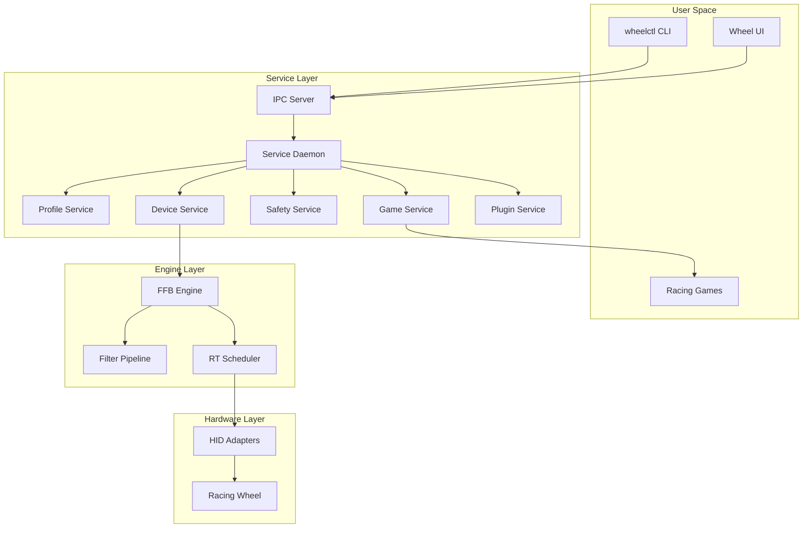

# Racing Wheel Software - System Integration Guide

This document describes the complete system integration, including all components working together with graceful degradation, feature flags, and comprehensive validation.

## Overview

The Racing Wheel Software is designed as a complete system with multiple integrated components:

- **Service Daemon (`wheeld`)**: Core service managing devices and force feedback
- **Engine**: Real-time force feedback processing at 1kHz
- **IPC Layer**: Inter-process communication between components
- **Game Integration**: Telemetry adapters for racing simulators
- **Safety System**: Comprehensive safety and fault management
- **Plugin System**: Extensible architecture for custom functionality
- **UI/CLI**: User interfaces for configuration and monitoring

## Architecture



## System Configuration

### Configuration Hierarchy

The system uses a hierarchical configuration system:

1. **System Config** (`system.json`): Global system settings
2. **Service Config**: Service-specific settings
3. **Profile Config**: Per-game/car/track profiles
4. **Runtime Flags**: Command-line and environment overrides

### Configuration Files

```
Windows: %LOCALAPPDATA%\wheel\
Linux:   ~/.config/wheel/

├── system.json          # Main system configuration
├── profiles/            # Profile hierarchy
│   ├── global.json
│   ├── iracing/
│   └── acc/
├── plugins/             # Plugin configurations
├── logs/               # Service logs
└── diagnostics/        # Diagnostic data
```

### Feature Flags

The system supports comprehensive feature flags for development and testing:

```rust
pub struct FeatureFlags {
    pub disable_realtime: bool,        // Disable RT scheduling (for CI)
    pub force_ffb_mode: Option<String>, // Force specific FFB mode
    pub enable_dev_features: bool,      // Enable development features
    pub enable_debug_logging: bool,     // Enhanced logging
    pub enable_virtual_devices: bool,   // Virtual device simulation
    pub disable_safety_interlocks: bool, // DANGEROUS: Disable safety
    pub enable_plugin_dev_mode: bool,   // Plugin development mode
}
```

## Service Management

### Installation

```bash
# Install service
wheeld install

# Check status
wheeld status

# Uninstall service
wheeld uninstall
```

### Command Line Interface

```bash
# Basic usage
wheeld [OPTIONS] [COMMAND]

# Development flags
wheeld --mode=raw --rt-off --dev --verbose

# Commands
wheeld validate      # Validate configuration
wheeld diagnostics   # Run system diagnostics
wheeld anti-cheat    # Generate anti-cheat report
```

### Service Lifecycle

1. **Startup**: Load configuration, initialize services
2. **Device Discovery**: Enumerate and connect to racing wheels
3. **Game Detection**: Monitor for supported racing games
4. **Runtime**: Process force feedback and telemetry
5. **Shutdown**: Graceful cleanup and state preservation

## Graceful Degradation

The system is designed to continue operating even when components fail:

### Device Failures
- **No Devices**: Service continues, profiles remain available
- **Device Disconnect**: Automatic reconnection attempts
- **Device Fault**: Immediate safety shutdown, fault logging

### Game Integration Failures
- **No Games**: Device functionality remains available
- **Telemetry Loss**: LEDs/haptics degrade gracefully
- **Config Errors**: Manual configuration remains possible

### Service Failures
- **Profile Service**: Uses cached profiles, read-only mode
- **Safety Service**: Defaults to safe torque mode
- **Plugin Service**: Disables plugins, core functionality continues

### Network Failures
- **IPC Failure**: Service continues, UI shows disconnected
- **Telemetry Network**: Falls back to file-based detection
- **Update Service**: Continues with current version

## Performance Requirements

### Real-Time Guarantees

The system maintains strict performance requirements:

- **Tick Rate**: 1000 Hz (1ms intervals)
- **Jitter**: p99 ≤ 0.25ms
- **Processing Budget**: ≤ 200μs per tick
- **HID Write Latency**: p99 ≤ 300μs
- **Total Added Latency**: ≤ 2ms end-to-end

### Performance Monitoring

```rust
// Performance metrics collected continuously
pub struct PerformanceMetrics {
    pub tick_jitter_us: Histogram,
    pub processing_time_us: Histogram,
    pub hid_write_latency_us: Histogram,
    pub missed_ticks: Counter,
    pub cpu_usage_percent: Gauge,
    pub memory_usage_mb: Gauge,
}
```

### Performance Validation

```bash
# Run performance tests
cargo test --release test_performance

# Run benchmarks
cargo bench --bench rt_timing

# System validation
python scripts/validate_system.py
```

## Safety System Integration

### Safety State Machine

```rust
pub enum SafetyState {
    SafeTorque,                    // Default safe state
    HighTorqueChallenge { .. },    // Awaiting user confirmation
    HighTorqueActive { .. },       // High torque enabled
    Faulted { fault, since },      // Fault condition active
}
```

### Fault Detection and Response

The system monitors for various fault conditions:

- **USB Timeout**: No device response within 3 frames
- **Encoder Errors**: NaN or out-of-range values
- **Thermal Limits**: Device temperature > threshold
- **Overcurrent**: Current draw exceeds limits
- **Plugin Overrun**: Plugin exceeds time budget

All faults trigger immediate torque ramp-down within 50ms.

### Safety Interlocks

- **Physical Interlock**: Requires device button combination
- **UI Consent**: Explicit user acknowledgment for high torque
- **Session Persistence**: Safety state persists until power cycle
- **Fault History**: Maintains fault log for diagnostics

## Game Integration

### Supported Games

| Game | Method | Config Files | Auto-Config | Status |
|------|--------|--------------|-------------|---------|
| iRacing | Shared Memory | app.ini | ✅ | Full Support |
| ACC | UDP Broadcast | broadcasting.json | ✅ | Full Support |
| AMS2 | Shared Memory | None | ❌ | Read-Only |
| rFactor 2 | Plugin API | Plugin Install | 🔄 | Planned |

### Telemetry Processing

```rust
pub struct NormalizedTelemetry {
    pub ffb_scalar: f32,      // Force feedback input
    pub rpm: f32,             // Engine RPM
    pub speed_ms: f32,        // Vehicle speed
    pub slip_ratio: f32,      // Tire slip
    pub gear: i8,             // Current gear
    pub flags: TelemetryFlags, // Status flags
    pub car_id: Option<String>,
    pub track_id: Option<String>,
}
```

### Auto-Configuration

The system can automatically configure games for telemetry:

1. **Game Detection**: Monitor process list for supported games
2. **Config Backup**: Create backup of existing configuration
3. **Config Modification**: Apply required telemetry settings
4. **Validation**: Verify configuration was applied correctly
5. **Rollback**: Restore original config if validation fails

## Plugin System

### Plugin Architecture

```rust
// Safe plugins (WASM)
pub trait SafePlugin {
    fn process_telemetry(&mut self, input: &NormalizedTelemetry) -> Result<PluginOutput>;
    fn process_led_mapping(&mut self, input: &LedMappingInput) -> Result<LedPattern>;
}

// Fast plugins (Native, isolated)
pub trait FastPlugin {
    fn process_frame(&mut self, frame: &mut Frame) -> Result<()>;
}
```

### Plugin Isolation

- **WASM Plugins**: Sandboxed execution with capability restrictions
- **Native Plugins**: Separate helper process with watchdog
- **Crash Isolation**: Plugin failures don't affect core service
- **Resource Limits**: Memory and CPU usage monitoring
- **Time Budgets**: Strict execution time limits

## Diagnostics and Validation

### System Diagnostics

```bash
# Run comprehensive diagnostics
wheeld diagnostics

# Specific diagnostic categories
wheeld diagnostics --category=hardware
wheeld diagnostics --category=performance
wheeld diagnostics --category=configuration
```

### Diagnostic Categories

1. **System Requirements**: OS, CPU, memory validation
2. **Hardware**: HID device detection and testing
3. **Performance**: Timing and jitter validation
4. **Configuration**: Config file validation
5. **Permissions**: File and device access validation
6. **Network**: Telemetry port availability
7. **Game Integration**: Game detection and config validation
8. **Safety System**: Safety mechanism testing

### Blackbox Recording

The system maintains comprehensive blackbox recording:

```rust
pub struct BlackboxRecord {
    pub timestamp_ns: u64,
    pub frame_data: Frame,
    pub device_telemetry: DeviceTelemetry,
    pub safety_state: SafetyState,
    pub fault_markers: Vec<FaultMarker>,
}
```

### Support Bundle Generation

```bash
# Generate support bundle
wheeld diagnostics --support-bundle

# Contents:
# - 2-minute blackbox recording
# - System configuration
# - Performance metrics
# - Fault history
# - System information
```

## Anti-Cheat Compatibility

### Compatibility Measures

- **No Process Injection**: External communication only
- **No Kernel Drivers**: User-space operation only
- **Documented Methods**: Official APIs and documented interfaces
- **Process Isolation**: Clear boundaries between components
- **Signed Binaries**: All executables digitally signed

### Compatibility Report

```bash
# Generate anti-cheat compatibility report
wheeld anti-cheat

# Output: anticheat_compatibility_report.md
```

The report documents:
- Process architecture and privilege levels
- Telemetry methods and implementation details
- File and network access patterns
- System API usage and justification
- Security measures and verification methods

## Testing and Validation

### Test Categories

1. **Unit Tests**: Individual component testing
2. **Integration Tests**: Component interaction testing
3. **Performance Tests**: Timing and throughput validation
4. **Hardware-in-Loop**: Real device testing
5. **System Tests**: End-to-end workflow validation

### Continuous Integration

```yaml
# CI Pipeline
- Build: All platforms and configurations
- Test: Unit, integration, and performance tests
- Validate: System requirements and compatibility
- Package: Signed binaries and installers
- Deploy: Release artifacts and documentation
```

### Validation Script

```bash
# Comprehensive system validation
python scripts/validate_system.py

# Quick validation (skip time-consuming tests)
python scripts/validate_system.py --quick

# Generate detailed report
python scripts/validate_system.py --output validation_report.json
```

## Deployment and Updates

### Installation Requirements

- **Windows**: Windows 10+ (x64)
- **Linux**: Modern distribution with kernel 4.0+ (x64)
- **Memory**: 4GB RAM recommended
- **CPU**: Multi-core processor recommended
- **Storage**: 500MB available space

### Update Mechanism

- **Delta Updates**: Minimize download size
- **Signed Updates**: Cryptographic verification
- **Rollback**: Automatic rollback on failure
- **Staged Rollout**: Gradual deployment with monitoring

### Service Management

The service integrates with platform service managers:

- **Windows**: Task Scheduler user service
- **Linux**: systemd user service
- **Auto-Start**: Starts on user login
- **Recovery**: Automatic restart on failure

## Troubleshooting

### Common Issues

1. **High Jitter**: Check system load, disable power management
2. **Device Not Found**: Verify drivers, check permissions
3. **Telemetry Loss**: Check game configuration, firewall settings
4. **Safety Faults**: Review fault log, check device temperature

### Debug Mode

```bash
# Enable debug logging
wheeld --verbose --dev

# Check service logs
# Windows: %LOCALAPPDATA%\wheel\logs\
# Linux: ~/.config/wheel/logs/
```

### Performance Analysis

```bash
# Real-time performance monitoring
wheeld --mode=raw --rt-off  # Disable RT for analysis

# Collect performance traces
# Windows: Use ETW traces
# Linux: Use perf or tracepoints
```

## Conclusion

The Racing Wheel Software provides a comprehensive, integrated system for racing wheel management with:

- **Robust Architecture**: Modular design with clear interfaces
- **Graceful Degradation**: Continues operation despite component failures
- **Performance Guarantees**: Strict real-time requirements with monitoring
- **Safety First**: Comprehensive safety system with fault detection
- **Anti-Cheat Compatible**: Designed for compatibility with all major anti-cheat systems
- **Extensible**: Plugin system for community contributions
- **Observable**: Comprehensive diagnostics and monitoring

The system is designed to provide professional-grade racing wheel software that meets the needs of both casual and competitive sim racers while maintaining the highest standards of safety, performance, and compatibility.