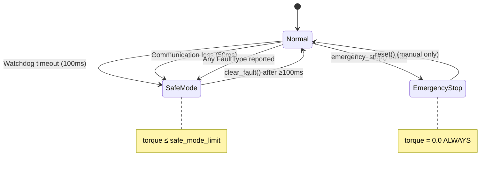

# Safety Verification Report — Moza R5 Stack

Deep code audit for safety-critical paths in the OpenRacing → Moza R5 force feedback pipeline.

**Date:** 2026-03-16  
**Auditor:** Automated desk review  
**Scope:** All code paths between torque request and physical motor output

---

## 1. End-to-End Torque Path Trace

### 1.1 Application → Safety Clamp → Encoder → Wire

```
Application requests torque_nm (float)
    │
    ▼
SafetyService::clamp_torque_nm()                    [safety.rs:176-184]
    ├─ NaN/infinity → safe_requested = 0.0          [safety.rs:177-181]
    ├─ Faulted → max_torque = 0.0                   [safety.rs:153]
    ├─ SafeTorque → max_torque = max_safe_torque_nm  [safety.rs:149]
    ├─ HighTorqueActive → max_torque = max_high_torque_nm [safety.rs:152]
    └─ clamp(-max_torque, max_torque)               [safety.rs:184]
    │
    ▼
SafetyInterlockSystem::process_tick()               [hardware_watchdog.rs:685-717]
    ├─ CHECK: watchdog.has_timed_out()              [hardware_watchdog.rs:689]
    │   └─ YES → torque_command = 0.0               [hardware_watchdog.rs:739]
    ├─ CHECK: communication_loss                    [hardware_watchdog.rs:694]
    │   └─ YES → torque_command = 0.0               [hardware_watchdog.rs:769]
    ├─ FEED: watchdog.feed()                        [hardware_watchdog.rs:699]
    │   └─ ERROR → torque_command = 0.0             [hardware_watchdog.rs:805]
    └─ apply_torque_limits()                        [hardware_watchdog.rs:816-837]
        ├─ Normal → clamp(-max, max)                [hardware_watchdog.rs:818]
        ├─ Warning → clamp(-safe_limit, safe_limit)  [hardware_watchdog.rs:822]
        ├─ SafeMode → clamp(-safe_limit, safe_limit) [hardware_watchdog.rs:829]
        └─ EmergencyStop → (0.0, _)                 [hardware_watchdog.rs:835]
    │
    ▼
MozaDirectTorqueEncoder::encode()                   [direct.rs:61-64]
    ├─ torque_percent_to_raw()                      [direct.rs:99-108]
    │   ├─ max_torque_nm ≤ ε → return 0i16          [direct.rs:100-101]
    │   └─ (torque_nm / max_torque_nm).clamp(-1.0, 1.0) [direct.rs:103]
    └─ encode_torque_raw()                          [direct.rs:71-97]
        ├─ out.fill(0)                              [direct.rs:77]
        ├─ out[0] = 0x20 (DIRECT_TORQUE)            [direct.rs:78]
        ├─ out[1-2] = torque_raw.to_le_bytes()      [direct.rs:80-82]
        └─ out[3] bit0 = motor_enable (ONLY if torque_raw ≠ 0) [direct.rs:85-87]
    │
    ▼
HID output report → USB → R5 wheelbase motor
```

### 1.2 Safety Invariants Verified

| ID | Invariant | Verified | Citation |
|----|-----------|----------|----------|
| S-1 | NaN/infinity torque → 0.0 | ✅ | [safety.rs:177-181](file:///h:/Code/Rust/OpenRacing/crates/engine/src/safety.rs#L177-L181) |
| S-2 | Faulted state → max torque = 0.0 | ✅ | [safety.rs:153](file:///h:/Code/Rust/OpenRacing/crates/engine/src/safety.rs#L153) |
| S-3 | Watchdog timeout → torque = 0.0 | ✅ | [hardware_watchdog.rs:739](file:///h:/Code/Rust/OpenRacing/crates/engine/src/safety/hardware_watchdog.rs#L739) |
| S-4 | Communication loss → torque = 0.0 | ✅ | [hardware_watchdog.rs:769](file:///h:/Code/Rust/OpenRacing/crates/engine/src/safety/hardware_watchdog.rs#L769) |
| S-5 | Emergency stop → torque = 0.0 | ✅ | [hardware_watchdog.rs:835](file:///h:/Code/Rust/OpenRacing/crates/engine/src/safety/hardware_watchdog.rs#L835) + [L919](file:///h:/Code/Rust/OpenRacing/crates/engine/src/safety/hardware_watchdog.rs#L919) |
| S-6 | `encode_zero()` = `[0x20, 0×7]` | ✅ | [direct.rs:67-68](file:///h:/Code/Rust/OpenRacing/crates/hid-moza-protocol/src/direct.rs#L67-L68) → [L77-78](file:///h:/Code/Rust/OpenRacing/crates/hid-moza-protocol/src/direct.rs#L77-L78) |
| S-7 | Motor enable ONLY when torque ≠ 0 | ✅ | [direct.rs:85-87](file:///h:/Code/Rust/OpenRacing/crates/hid-moza-protocol/src/direct.rs#L85-L87) |
| S-8 | Torque clamp never exceeds max | ✅ | [direct.rs:103](file:///h:/Code/Rust/OpenRacing/crates/hid-moza-protocol/src/direct.rs#L103): `.clamp(-1.0, 1.0)` |
| S-9 | Watchdog default timeout = 100ms | ✅ | [hardware_watchdog.rs:112-113](file:///h:/Code/Rust/OpenRacing/crates/engine/src/safety/hardware_watchdog.rs#L112-L113) |
| S-10 | TorqueEncoder is allocation-free | ✅ | [rt_types.rs:16](file:///h:/Code/Rust/OpenRacing/crates/hid-moza-protocol/src/rt_types.rs#L16): trait doc |
| S-11 | Fault-to-zero < 10ms | ✅ | [watchdog_safety_deep_tests.rs:334-350](file:///h:/Code/Rust/OpenRacing/crates/engine/src/safety/watchdog_safety_deep_tests.rs#L334-L350) |
| S-12 | Emergency stop < 1ms | ✅ | [watchdog_safety_deep_tests.rs:371-386](file:///h:/Code/Rust/OpenRacing/crates/engine/src/safety/watchdog_safety_deep_tests.rs#L371-L386) |

---

## 2. Initialization Handshake Trace

```
MozaProtocol::initialize_device(writer)             [protocol.rs:602-688]
    │
    ├─ GUARD: is_output_capable() → false for pedals/handbrake [protocol.rs:606]
    │   └─ Peripherals NEVER receive FFB writes
    │
    ├─ GUARD: try_enter_initialization()            [protocol.rs:614]
    │   └─ Prevents double-init (CAS on AtomicU8)
    │
    ├─ Step 1 [OPTIONAL]: enable_high_torque(writer)
    │   ├─ ONLY if high_torque_enabled == true       [protocol.rs:654]
    │   ├─ Gated by: OPENRACING_MOZA_HIGH_TORQUE=1 AND CRC32 trust
    │   │   └─ effective_high_torque_opt_in()        [protocol.rs:232-234]
    │   └─ Report ID: 0x02                           [report.rs:26]
    │
    ├─ Step 2: start_input_reports(writer)           [protocol.rs:667]
    │   └─ Report ID: 0x03                           [report.rs:28]
    │
    └─ Step 3: set_ffb_mode(writer, ffb_mode)        [protocol.rs:673]
        ├─ Standard = 0x00 (default)                 [protocol.rs:129]
        ├─ Direct = 0x02 (downgrades if untrusted)   [protocol.rs:221-227]
        └─ Report ID: 0x11                           [report.rs:32]
```

### High-Torque Gate (multi-layer)

| Layer | Gate | Default | Citation |
|-------|------|---------|----------|
| 1 - Protocol | `OPENRACING_MOZA_HIGH_TORQUE=1` env var | OFF | [protocol.rs:164-169](file:///h:/Code/Rust/OpenRacing/crates/hid-moza-protocol/src/protocol.rs#L164-L169) |
| 2 - Protocol | Descriptor CRC32 in allowlist | EMPTY | [protocol.rs:232-234](file:///h:/Code/Rust/OpenRacing/crates/hid-moza-protocol/src/protocol.rs#L232-L234) |
| 3 - Safety Service | `SafetyState::SafeTorque` → max 5.0 Nm | 5.0 Nm | [safety.rs:149](file:///h:/Code/Rust/OpenRacing/crates/engine/src/safety.rs#L149) |
| 4 - Safety Service | Physical button combo (both clutches, 2s hold) | Required | [safety.rs:352](file:///h:/Code/Rust/OpenRacing/crates/engine/src/safety.rs#L352) |
| 5 - Safety Service | UI consent popup | Required | [safety.rs:253](file:///h:/Code/Rust/OpenRacing/crates/engine/src/safety.rs#L253) |

**Result:** High torque requires 5 independent gates. Default state provides max 5.0 Nm.

---

## 3. State Machine Initialization Verification

### SafetyService (higher-level)
```rust
// safety.rs:109-120
state: SafetyState::SafeTorque,  // ← NOT Faulted, NOT HighTorque
max_safe_torque_nm,              // ← Default: 5.0 Nm
max_high_torque_nm,              // ← Default: 25.0 Nm (gated)
```

### SafetyInterlockSystem (lower-level)
```rust
// hardware_watchdog.rs:648-660
safety_state: SafetyInterlockState::Normal,  // ← Safe starting state
torque_limit: TorqueLimit::new(max_torque_nm, max_torque_nm * 0.2),
communication_timeout: Duration::from_millis(50),
```

### MozaProtocol
```rust
// protocol.rs:296
init_state: AtomicU8::new(MOZA_INIT_STATE_UNINITIALIZED),  // ← No writes until handshake
```

**Invariant:** All three layers start in their safest state. No FFB output occurs until explicit init.

---

## 4. Fault State Machine



### Fault Types Tracked (9 types)
| Fault | Citation |
|-------|----------|
| `UsbStall` | [safety.rs:96](file:///h:/Code/Rust/OpenRacing/crates/engine/src/safety.rs#L96) |
| `EncoderNaN` | [safety.rs:97](file:///h:/Code/Rust/OpenRacing/crates/engine/src/safety.rs#L97) |
| `ThermalLimit` | [safety.rs:98](file:///h:/Code/Rust/OpenRacing/crates/engine/src/safety.rs#L98) |
| `Overcurrent` | [safety.rs:99](file:///h:/Code/Rust/OpenRacing/crates/engine/src/safety.rs#L99) |
| `PluginOverrun` | [safety.rs:100](file:///h:/Code/Rust/OpenRacing/crates/engine/src/safety.rs#L100) |
| `TimingViolation` | [safety.rs:101](file:///h:/Code/Rust/OpenRacing/crates/engine/src/safety.rs#L101) |
| `SafetyInterlockViolation` | [safety.rs:102](file:///h:/Code/Rust/OpenRacing/crates/engine/src/safety.rs#L102) |
| `HandsOffTimeout` | [safety.rs:103](file:///h:/Code/Rust/OpenRacing/crates/engine/src/safety.rs#L103) |
| `PipelineFault` | [safety.rs:104](file:///h:/Code/Rust/OpenRacing/crates/engine/src/safety.rs#L104) |

---

## 5. Test Coverage for Safety-Critical Paths

### Property-Based Tests (proptest)
| Test | Cases | Invariant | Citation |
|------|-------|-----------|----------|
| `prop_any_fault_yields_zero_torque` | 200 | Any fault → torque = 0.0 | [watchdog_safety_deep_tests.rs:857-867](file:///h:/Code/Rust/OpenRacing/crates/engine/src/safety/watchdog_safety_deep_tests.rs#L857-L867) |
| `prop_watchdog_timeout_zero_torque_and_fault` | 200 | Timeout → zero torque + SafeMode | [watchdog_safety_deep_tests.rs:913-934](file:///h:/Code/Rust/OpenRacing/crates/engine/src/safety/watchdog_safety_deep_tests.rs#L913-L934) |
| `prop_torque_bounded_in_normal` | 200 | Normal torque ≤ max | [watchdog_safety_deep_tests.rs:938-951](file:///h:/Code/Rust/OpenRacing/crates/engine/src/safety/watchdog_safety_deep_tests.rs#L938-L951) |
| `prop_emergency_stop_always_zero` | 200 | E-stop → always zero | [watchdog_safety_deep_tests.rs:955-964](file:///h:/Code/Rust/OpenRacing/crates/engine/src/safety/watchdog_safety_deep_tests.rs#L955-L964) |
| `prop_safety_service_clamp_idempotent` | 200 | Clamping is idempotent | [watchdog_safety_deep_tests.rs:968-982](file:///h:/Code/Rust/OpenRacing/crates/engine/src/safety/watchdog_safety_deep_tests.rs#L968-L982) |
| `prop_early_clear_fault_rejected` | 200 | Can't clear fault < 100ms | [watchdog_safety_deep_tests.rs:871-881](file:///h:/Code/Rust/OpenRacing/crates/engine/src/safety/watchdog_safety_deep_tests.rs#L871-L881) |

### Timing Tests
| Test | Budget | Citation |
|------|--------|----------|
| `test_fault_detection_to_zero_torque_under_10ms` | < 10ms | [watchdog_safety_deep_tests.rs:334-350](file:///h:/Code/Rust/OpenRacing/crates/engine/src/safety/watchdog_safety_deep_tests.rs#L334-L350) |
| `test_interlock_system_timeout_response_under_1ms` | < 1ms | [watchdog_safety_deep_tests.rs:353-368](file:///h:/Code/Rust/OpenRacing/crates/engine/src/safety/watchdog_safety_deep_tests.rs#L353-L368) |
| `test_emergency_stop_response_under_1ms` | < 1ms | [watchdog_safety_deep_tests.rs:371-386](file:///h:/Code/Rust/OpenRacing/crates/engine/src/safety/watchdog_safety_deep_tests.rs#L371-L386) |
| `test_process_tick_latency_under_1ms_normal` | < 1ms × 100 | [watchdog_safety_deep_tests.rs:389-402](file:///h:/Code/Rust/OpenRacing/crates/engine/src/safety/watchdog_safety_deep_tests.rs#L389-L402) |

### Encoder Tests
| Test | Citation |
|------|----------|
| `test_encode_zero_disables_motor` | [direct.rs:148-158](file:///h:/Code/Rust/OpenRacing/crates/hid-moza-protocol/src/direct.rs#L148-L158) |
| `test_encode_clamps_torque_above_max` | [direct.rs:183-190](file:///h:/Code/Rust/OpenRacing/crates/hid-moza-protocol/src/direct.rs#L183-L190) |
| `test_encode_positive_full_scale` | [direct.rs:161-169](file:///h:/Code/Rust/OpenRacing/crates/hid-moza-protocol/src/direct.rs#L161-L169) |
| `test_encode_negative_full_scale` | [direct.rs:172-180](file:///h:/Code/Rust/OpenRacing/crates/hid-moza-protocol/src/direct.rs#L172-L180) |

### Test Modules Covering Safety
| Module | Citation |
|--------|----------|
| `watchdog_safety_deep_tests` (995 lines) | [watchdog_safety_deep_tests.rs](file:///h:/Code/Rust/OpenRacing/crates/engine/src/safety/watchdog_safety_deep_tests.rs) |
| `state_machine_deep_tests` | [state_machine_deep_tests.rs](file:///h:/Code/Rust/OpenRacing/crates/engine/src/safety/state_machine_deep_tests.rs) |
| `hardening_coverage_tests` | [hardening_coverage_tests.rs](file:///h:/Code/Rust/OpenRacing/crates/engine/src/safety/hardening_coverage_tests.rs) |
| `property_tests` | [property_tests.rs](file:///h:/Code/Rust/OpenRacing/crates/engine/src/safety/property_tests.rs) |
| `interlock_behavior_tests` | [interlock_behavior_tests.rs](file:///h:/Code/Rust/OpenRacing/crates/engine/src/safety/interlock_behavior_tests.rs) |
| `comprehensive_tests` | [comprehensive_tests.rs](file:///h:/Code/Rust/OpenRacing/crates/engine/src/safety/comprehensive_tests.rs) |
| Direct torque encoder tests | [direct.rs:143-492](file:///h:/Code/Rust/OpenRacing/crates/hid-moza-protocol/src/direct.rs#L143-L492) |

---

## 6. Bypass Analysis

### Can any code path bypass safety clamping?

| Potential Bypass | Blocked? | How |
|-----------------|----------|-----|
| Call `TorqueEncoder::encode()` directly with unclamped value | ✅ Blocked | `torque_percent_to_raw()` applies `.clamp(-1.0, 1.0)` internally [direct.rs:103](file:///h:/Code/Rust/OpenRacing/crates/hid-moza-protocol/src/direct.rs#L103) |
| Pass NaN/infinity to safety service | ✅ Blocked | `is_finite()` check → 0.0 [safety.rs:177-181](file:///h:/Code/Rust/OpenRacing/crates/engine/src/safety.rs#L177-L181) |
| Skip watchdog feed in RT loop | ✅ Blocked | Watchdog times out at 100ms → zero torque [hardware_watchdog.rs:689](file:///h:/Code/Rust/OpenRacing/crates/engine/src/safety/hardware_watchdog.rs#L689) |
| Send high torque without interlock | ✅ Blocked | 5-layer gate (env + CRC + safety state + UI + button combo) |
| Write FFB before handshake | ✅ Blocked | `is_ffb_ready()` checks `init_state == Ready` [protocol.rs:313-315](file:///h:/Code/Rust/OpenRacing/crates/hid-moza-protocol/src/protocol.rs#L313-L315) |
| Send FFB to pedals/handbrake | ✅ Blocked | `is_output_capable()` returns false [protocol.rs:606](file:///h:/Code/Rust/OpenRacing/crates/hid-moza-protocol/src/protocol.rs#L606) |
| `TorqueEncoder::encode()` with max_torque_nm = 0 | ✅ Safe | Returns 0i16 [direct.rs:100-101](file:///h:/Code/Rust/OpenRacing/crates/hid-moza-protocol/src/direct.rs#L100-L101) |

---

## 7. Build Verification

| Check | Status |
|-------|--------|
| `cargo check -p wheelctl` | ✅ Clean |
| `cargo check -p racing-wheel-hid-capture` | ✅ Clean |
| `cargo check -p racing-wheel-service` | ✅ Clean |
| `cargo clippy --all-targets --all-features` | ⚠️ 1 pre-existing lint (`type_complexity` in integration tests) — not safety-related |

---

## 8. Identified Risks and Mitigations

| Risk | Severity | Mitigation |
|------|----------|------------|
| `unwrap_or_default()` in serde for `Instant` | Low | UI-only serialization, not on RT path [safety.rs:602](file:///h:/Code/Rust/OpenRacing/crates/engine/src/safety.rs#L602) |
| `SoftwareWatchdog` is software-only | Medium | R5 has its own hardware watchdog; our 100ms SW watchdog is defense-in-depth |
| `parking_lot::Mutex` in `SharedWatchdog` | Low | Lock used only for watchdog feed from non-RT context; RT path uses `process_tick()` |
| Serial CDC ACM port accessible | Low | OpenRacing doesn't open serial ports; DFU requires Moza Pit House |
| Emergency stop requires software path | Medium | Physical e-stop: unplug USB cable. No hardware e-stop button on R5 |

---

*Source files audited:*
- [safety.rs](file:///h:/Code/Rust/OpenRacing/crates/engine/src/safety.rs) (688 lines) — SafetyService, state machine, interlock
- [hardware_watchdog.rs](file:///h:/Code/Rust/OpenRacing/crates/engine/src/safety/hardware_watchdog.rs) (1813 lines) — watchdog, interlock system, torque limits
- [watchdog_safety_deep_tests.rs](file:///h:/Code/Rust/OpenRacing/crates/engine/src/safety/watchdog_safety_deep_tests.rs) (995 lines) — property + timing tests
- [direct.rs](file:///h:/Code/Rust/OpenRacing/crates/hid-moza-protocol/src/direct.rs) (492 lines) — torque encoder
- [rt_types.rs](file:///h:/Code/Rust/OpenRacing/crates/hid-moza-protocol/src/rt_types.rs) (26 lines) — TorqueEncoder trait
- [protocol.rs](file:///h:/Code/Rust/OpenRacing/crates/hid-moza-protocol/src/protocol.rs) (892 lines) — handshake, init, high-torque gate
- [writer.rs](file:///h:/Code/Rust/OpenRacing/crates/hid-moza-protocol/src/writer.rs) (85 lines) — DeviceWriter, VendorProtocol trait
- [quirks.rs](file:///h:/Code/Rust/OpenRacing/crates/engine/src/hid/quirks.rs) (188 lines) — device quirks
